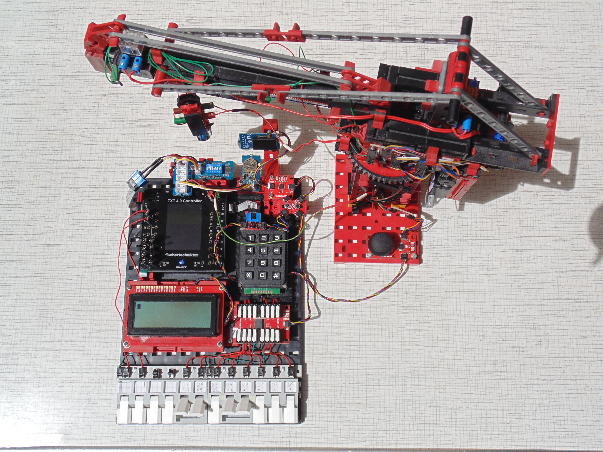

[I²C Module](https://elssner.github.io/ft-Controller-I2C/#tabelle-1) |
[Programmierbeispiele](https://elssner.github.io/ft-Controller-I2C/#beispielepy) |
[I²C Hardware, Software](https://elssner.github.io/ft-Controller-I2C/#ic) |
[I²C Programmierung, Blöcke](https://elssner.github.io/ft-Controller-I2C/#beschreibung-der-quellcodedateien-alphabetisch-geordnet)

### ROBO Pro Coding Blöcke für fischertechnik TXT 4.0 und RX Controller zur Programmierung eigener I²C Module.

Das Beispiel Projekt mit Blöcken für TXT 4.0 Controller ist im [fischertechnik GitLab](https://git.fischertechnik-cloud.com/i2c) veröffentlicht. <ins>Es kann für RX Controller konvertiert werden.</ins>
Alle I²C-Module und Programmierbeispiele auf dieser Seite wurden mit dem TXT 4.0 Controller und auch mit dem RX Controller getestet.

Mit der [App ROBO Pro Coding](https://www.fischertechnik.de/de-de/apps-und-software#apps) kann das Projekt ohne Anmeldung von fischertechnik GitLab geladen werden. 
Dazu bleibt das Zugriffstoken leer und auf der nächsten Seite im Suchfeld kann `i2c` eingegeben werden. Der Name ist `i2c / ft_Controller_I2C`. Das Projekt kann dann lokal als .ft-Datei gespeichert werden.

#### Im Projekt enthaltene Quellcodedateien (Blöcke) für I²C Module.

Für eigene Projekte können aus der lokal gespeicherten .ft-Datei die Quellcodedateien importiert werden.
Der Import muss zweimal erfolgen: zuerst [i2cCode](#i2ccodepy) und optional [advanced](#advancedpy), beim zweiten Import die Dateien für die angeschlossenen I²C Module.\
Die Datei [i2cCode](#i2ccodepy) muss immer mit importiert werden.\
Die Datei [advanced](#advancedpy) enthält keine I²C spezifischen Blöcke, ist aber zu empfehlen.\
Aus der Datei [Beispiele](#beispielepy) könnte nur ein einzelner Block übernommen werden.\
Alle anderen Quellcodedateien in [Tabelle 1](#tabelle-1) sind bestimmten I²C Modulen zugeordnet.

###### Tabelle 1:
* Quellcodedateien mit Link zur Beschreibung der Blöcke (auf dieser Seite unten).
* I²C Module mit Link zur Hersteller Webseite mit Bild und Dokumentation.
* Nummern der Programmierbeispiele in [Tabelle 3](#tabelle-3), welche diese Module verwenden.

Quellcodedatei|I²C-Adresse|I²C Module|Beispiel Tabelle 3
---|---|---|---
[i2cCode](#i2ccodepy)||Python I²C für [RX](https://github.com/fischertechnik/RX-Controller-I2C) und [TXT 4.0](https://github.com/fischertechnik/TXT40-Controller-I2C)|alle
[advanced](#advancedpy)||Blöcke für fehlende Funktionen|11
[dipswitch](#dipswitchpy)|<code>0x03</code>|[6-DIP Switch](https://wiki.seeedstudio.com/Grove-6-Position_DIP_Switch), [5-Way Switch](https://wiki.seeedstudio.com/Grove-5-Way_Switch)|3
[keyboard](#keyboardpy)|<code>0x5F</code>|[M5Stack Card Keyboard](https://docs.m5stack.com/en/unit/cardkb_1.1)|2
[lcd16x2](#lcd16x2py)|<code>0x3E</code>|[Grove - LCD Display 16x2 Zeichen](https://wiki.seeedstudio.com/Grove-16x2_LCD_Series)|1, 2, 3
[oled](#oledpy)|<code>0x3C 0x3D</code>|OLED Displays [128x128](https://wiki.seeedstudio.com/Grove-OLED-Display-1.12-SH1107_V3.0), [128x64](https://wiki.seeedstudio.com/Grove-OLED-Yellow&Blue-Display-0.96-SSD1315_V1.0)|8, 9, 10, 11
[oled_geometrie](#oled_geometriepy)||Blöcke für Linien und Kreise|8, 10, 11
[qwiicbutton](#qwiicbuttonpy)|<code>0x6F 0x6E</code>|[SparkFun Qwiic Button](https://www.sparkfun.com/products/16842)|7
[qwiiceeprom](#qwiiceeprompy)|<code>0x50</code>|[SparkFun Qwiic EEPROM - 512Kbit](https://www.sparkfun.com/products/18355)|9, 10
[qwiicgpio](#qwiicgpiopy)|<code>0x27</code>|[SparkFun Qwiic GPIO](https://www.sparkfun.com/products/17047)|5
[qwiicjoystick](#qwiicjoystickpy)|<code>0x20</code>|[SparkFun Qwiic Joystick](https://www.sparkfun.com/products/15168)|6, 14, 15
[qwiickeypad](#qwiickeypadpy)|<code>0x4B</code>|[SparkFun Qwiic Keypad 12 Tasten](https://www.sparkfun.com/products/15290)|4, 5
[qwiiclcd](#qwiiclcdpy)|<code>0x72</code>|Qwiic LCD Displays [20x4](https://www.sparkfun.com/products/16398), [16x2](https://www.sparkfun.com/products/16396)|4, 5, 6
[qwiicmotor](#qwiicmotorpy)|<code>0x5D 0x5E</code>|[SparkFun Qwiic Motor Driver](https://www.sparkfun.com/products/15451)|14, 15
[qwiicopenlog](#qwiicopenlogpy)|<code>0x2A</code>|[SparkFun Qwiic OpenLog](https://www.sparkfun.com/products/15164)|
[qwiicrelay](#qwiicrelaypy)|<code>0x18</code>|[SparkFun Qwiic Single Relay](https://www.sparkfun.com/products/15093)|Hauptprogramm
[rtc](#rtcpy)|<code>0x51</code>|[Grove - RTC (Real Time Clock)](https://wiki.seeedstudio.com/Grove_High_Precision_RTC)|1, 4, 10
[s_co2](#s_co2py)|<code>0x62</code>|[Calliope mini CO2 Sensor - SCD40](https://calliope.cc/calliope-mini/erweiterungen/calliope-co2-sensor)|
[s_qwiicinfrared](#s_qwiicinfraredpy)|<code>0x60</code>|[Proximity Sensor VCNL4040](https://www.sparkfun.com/products/15177)|12
[s_qwiiclaser](#s_qwiiclaserpy)|<code>0x29</code>|Laser Sensor [VL53L1X](https://www.sparkfun.com/products/14722), [VL53L4CD](https://www.sparkfun.com/products/18993)|13
[s_qwiicultrasonic](#s_qwiicultrasonicpy)|<code>0x09</code>|[Ultrasonic Sensor HC-SR04](https://www.sparkfun.com/products/17777)|12
[wattmeter](#wattmeterpy)|<code>0x45</code>|[Gravity Digital Wattmeter](https://www.dfrobot.com/product-1827.html)|

#### Hauptprogramm in der App ROBO Pro Coding
* Mit Drahtbrücken an den Eingängen `I8 I7 I6 I5` kann der Start eines bestimmten Programmierbeispiels codiert werden. [Tabelle 2](#tabelle-2) zeigt die Codierung der Eingänge.
* Beispiel 0 ruft **i2c_scan** auf und zeigt die gefundenen I²C-Adressen in der Konsole an.
* Beispiel 13 **qlaser_konsole** zeigt Werte vom Distance Sensor in der Konsole an.
* Alle anderen Beispiele können nach Übertragung des Programms auf dem Controller (ohne Verbindung zur App) gestartet werden. Nur Drahtbrücken umstecken und Programm starten.

###### Tabelle 2:
* Codierung der Eingänge, um ein Beispiel vom Hauptprogramm zu starten.
* Name des Beispiel-Blocks und aufgerufende I²C Quellcodedateien aus [Tabelle 1](#tabelle-1).

`I8`|`I7`|`I6`|`I5`|Beispiel (Block)|Quellcodedateien, I²C Module
---|---|---|---|---|---
`0`|`0`|`0`|`0`|**i2c_scan**|[i2cCode](#i2ccodepy) (immer erforderlich)
`0`|`0`|`0`|`1`|**grovelcd_rtc**|[lcd16x2](#lcd16x2py), [rtc](#rtcpy)
`0`|`0`|`1`|`0`|**grovelcd_keyboard**|[lcd16x2](#lcd16x2py), [keyboard](#keyboardpy)
`0`|`0`|`1`|`1`|**grovelcd_dipswitch**|[lcd16x2](#lcd16x2py), [dipswitch](#dipswitchpy)
`0`|`1`|`0`|`0`|**qlcd_rtc_keypad**|[qwiiclcd](#qwiiclcdpy), [rtc](#rtcpy), [qwiickeypad](#qwiickeypadpy)
`0`|`1`|`0`|`1`|**qlcd_gpio_keypad**|[qwiiclcd](#qwiiclcdpy), [qwiicgpio](#qwiicgpiopy), [qwiickeypad](#qwiickeypadpy)
`0`|`1`|`1`|`0`|**qlcd_joystick**|[qwiiclcd](#qwiiclcdpy), [qwiicjoystick](#qwiicjoystickpy)
`0`|`1`|`1`|`1`|**qbutton2_queue**|[qwiicbutton](#qwiicbuttonpy)
`1`|`0`|`0`|`0`|**oled_zeichnen**|[oled](#oledpy), [oled_geometrie](#oled_geometriepy)
`1`|`0`|`0`|`1`|**oled_eeprom_copy**|[oled](#oledpy), [qwiiceeprom](#qwiiceeprompy)
`1`|`0`|`1`|`0`|**oled_eeprom_rtc**|[oled](#oledpy), [oled_geometrie](#oled_geometriepy), [qwiiceeprom](#qwiiceeprompy), [rtc](#rtcpy)
`1`|`0`|`1`|`1`|**oled2_systemtime**|[oled](#oledpy), [oled_geometrie](#oled_geometriepy), [advanced](#advancedpy)
`1`|`1`|`0`|`0`|**qlcd_qus_qir**|[qwiiclcd](#qwiiclcdpy), [s_qwiicultrasonic](#s_qwiicultrasonicpy), [s_qwiicinfrared](#s_qwiicinfraredpy)
`1`|`1`|`0`|`1`|**qlaser_konsole**|[s_qwiiclaser](#s_qwiiclaserpy)
`1`|`1`|`1`|`0`|**joy_2motoren**|[qwiicjoystick](#qwiicjoystickpy), [qwiicmotor](#qwiicmotorpy)
`1`|`1`|`1`|`1`|**joy_4motoren**|[qwiicjoystick](#qwiicjoystickpy), [qwiicmotor](#qwiicmotorpy)

#### Beispiele.py
* Programmierbeispiele zeigen die Nutzung mehrerer I²C Module gleichzeitig.
* Alle Programme sind für TXT 4.0 und (nach Projekt konvertieren) RX Controller geeignet.

###### Tabelle 3:

n|Beispiel (Block)|Beschreibung
---|---|---
0|**i2c_scan**|I²C-Adressen der angeschlossenen Module in Konsole
1|**grovelcd_rtc**|Grove LCD 16x2 zeigt Uhrzeit und Datum an.
2|**grovelcd_keyboard**|Grove LCD 16x2 schreiben mit Card Keyboard (50 Tasten).
3|**grovelcd_dipswitch**|Grove LCD 16x2 mit 6 DIP Schaltern oder 5-Way Switch.
4|**qlcd_rtc_keypad**|Qwiic LCD 16x2 oder 20x4 Uhr stellen und anzeigen.
5|**qlcd_gpio_keypad**|Qwiic LCD 16x2 oder 20x4 8 Bit Zeichencode Eingabe mit GPIO.
6|**qlcd_joystick**|Qwiic LCD 16x2 oder 20x4 zeigt Joystick Positionen an.
7|**qbutton2_queue**|2 Qwiic Buttons mit LED, FIFO in Konsole anzeigen.
8|**oled_zeichnen**|OLED 128x64 oder 128x128 Linien und Kreise anzeigen.
9|**oled_eeprom_copy**|OLED 128x64 oder 128x128 Zeichensatz aus EEPROM anzeigen.
10|**oled_eeprom_rtc**|OLED 128x64 oder 128x128 Datum, Uhrzeit digital und analog.
11|**oled2_systemtime**|2 OLED Displays, verschiedener Inhalt, Analoguhr System-Zeit.
12|**qlcd_qus_qir**|Qwiic LCD zeigt 2 Sensoren (Abstand und Nähe) an.
13|**qlaser_konsole**|Laser Distance Sensor in Konsole anzeigen.
14|**joy_2motoren**|2 Motoren (1 Modul) mit Joystick steuern.
15|**joy_4motoren**|4 Motoren (2 Module) mit Joystick umschalten und steuern.

### I²C

> I²C: Inter-Integrated Circuit → [de.wikipedia.org/wiki/I²C](https://de.wikipedia.org/wiki/I%C2%B2C)

###### I²C Hardware

* <ins>Der I²C-Bus hat **3,3 Volt** Logik. Höhere Spannungen zerstören den **Controller** sofort!</ins>
* An einen I²C-Bus mit 4 Leitungen können mehrere I²C Module gleichzeitig angeschlossen werden: [Qwiic daisy chain](https://www.sparkfun.com/qwiic) oder [Grove - I2C Hub](https://wiki.seeedstudio.com/Grove-I2C_Hub/).
* [Anschlussbelegung](https://github.com/fischertechnik/TXT40-Controller-I2C) 6-pin: `1:+3,3V` `2:GND` `5:SCL` `6:SDA` (3 und 4 nichts anschließen).
* Die Anzahl gleichzeitig angeschlossener Module ist aus elektrischen Gründen begrenzt.
* Qwiic Module haben immer 3,3V Logik und sind hervorragend geeignet.
* Grove Module mit 3,3V/5V verabschieden sich zuerst, wenn mehrere am I²C-Bus sind.
* M5Stack und andere Module mit 5V und müssen getestet werden.
* RX Controller verträgt am I²C-Bus nur 2-3 Module gleichzeitig, TXT 4.0 viel mehr.

[6-pin Pfosten Stecker](https://www.conrad.de/de/p/fci-75867-131lf-pfosten-steckverbinder-rastermass-2-54-mm-polzahl-gesamt-6-anzahl-reihen-2-1-st-1401777.html) | [Qwiic Adapter](https://www.sparkfun.com/sparkfun-qwiic-adapter.html) | [Qwiic Cable - Grove Adapter](https://www.sparkfun.com/qwiic-cable-grove-adapter-100mm.html) | [Qwiic Cable Kit](https://www.sparkfun.com/sparkfun-qwiic-cable-kit.html)

###### I²C Module mit Hardware Interrupt

I²C Module, die eine Eingabe machen, müssen normalerweise in einer dauerhaft Schleife ständig über den I²C-Bus abgefragt werden, ob sich der Zustand geändert hat. 
Sensoren, Button, Keypad, GPIO und RTC haben einen zusätzlichen (Löt-) Interrupt-Pin, der mit einem Controller Input verbunden werden kann. Ein `Eingang`**Starte jedes mal** Block kann bei Zustandsänderung ein Ereignis auslösen.
Mit dem Ereignis-Block kann die ständige Kommunikation über den I²C-Bus vermieden werden.\
Die /INT Pins aller I²C Module können miteinander verbunden an nur einen Controller Input angeschlossen werden. Ein Interrupt an einem I²C Modul schaltet den /INT Pegel auf LOW (GND).\
Weil der RX Controller keine Ereignisse unterstützt, kann der Controller Input in einer Schleife abgefragt werden, was den I²C-Bus ebenfalls entlastet.

###### I²C Software

* Die I²C Module müssen verschiedene 7-Bit I²C-Adressen haben.
* I²C kennt nur 2 Funktionen:\
**an eine I²C-Adresse Bytes senden** oder **von einer I²C-Adresse Bytes empfangen**
* Es gibt noch eine Kombination aus beiden und i2cScan soll alle Module am Bus finden.
* Die Anzahl über den I²C-Bus übertragener Bytes ist **nicht** auf 32 Byte begrenzt.

> [RX Controller nutzt CircuitPython](https://github.com/fischertechnik/RX-Controller-I2C), [TXT 4.0 Controller nutzt Python3](https://github.com/fischertechnik/TXT40-Controller-I2C). Beide unterstützen I²C, aber völlig verschieden.
> Die I²C Blöcke hier sind **plattformunabhängig** programmiert. Die Python Implementation wird erkannt und dann der entsprechende Code ausgeführt.

#### i2cCode.py

Block **i2c_write_buffer** (i2c_addr, write_buffer)

* Sendet alle Bytes aus der Liste *write_buffer* an die *i2c_addr*.
* *i2c_addr*: 7 Bit (0x00..0x7F bzw. 0..127)
* *write_buffer*: Liste darf nur 8-Bit Elemente (0x00..0xFF bzw. 0..255) enthalten.
* Parameter *write_buffer* kann mit `Datenstrukturen`**erzeuge Liste** übergeben werden.

Block **i2c_read_buffer** (i2c_addr, length) : Liste der Bytes

* Empfängt Bytes von der *i2c_addr*, *length* ist die Anzahl der Bytes.
* Die zurück gegebene Liste kann mit `Datenstrukturen`**in der Liste** gelesen werden.

Block **i2c_write_read_buffer** (i2c_addr, write_buffer, read_length) : Liste der Bytes

* Sendet und empfängt Bytes, ohne dazwischen den I²C-Bus frei zu geben.
* Erlaubt I²C Register adressieren und lesen mit nur einer Funktion.

Block **i2c_scan** () : Liste der 7-Bit I²C-Adressen

* Versucht alle möglichen I²C-Adressen in einer Schleife zu erreichen.
* Wenn read oder write erfolgreich ist, wird die gültige I²C Adresse in einer Liste gesammelt.
* Die zurück gegebene Liste kann mit `Text` **gib aus** in der Konsole angezeigt werden.
* Es können Fehler auftreten, die Aus- und Einschalten des Controllers erfordern.
* Test i2cScan TXT 4.0 Controller mit echter Hardware (10 I²C Module gleichzeitig):\
['0x3', '0x20', '0x27', '0x3c', '0x4b', '0x50', '0x51', '0x5d', '0x5e', '0x72']

Block **is_rx** () : Boolean

* Gibt True zurück, wenn `sys.implementation.name == 'circuitpython'`.
* Davon abhängig werden für I²C verschiedene Importe gemacht:
* True: circuitpython `from adafruit_bus_device.i2c_device import I2CDevice`
* False: Python3 `from smbus2 import SMBus, i2c_msg`

### Beschreibung der Quellcodedateien (alphabetisch geordnet)
Inhaltsverzeichnis: [Tabelle 1](#tabelle-1)

#### advanced.py

> Allgemeine Blöcke, die Python-Funktionen bereit stellen (ohne I²C Bezug).

Block **Kommentar** (text)\
Block **Int** (x) : Integer *int(x)*\
Block **Ord** (char) : Integer Zeichencode *ord(char)*\
Block **Chr** (asc) : String 1 Zeichen *chr(asc)*\
Block **print_bin** (zahl, length) : BIN String z.B. '00001010'; Binärzahl mit fester Länge\
Block **list_string** (string_data) : Liste der Zeichencodes *[ord(c) for c in string_data]*\
Block **encode_string** (string_data) : Liste der Zeichencodes *string_data.encode('utf-8')*\
Block **decode_string** (data_bytes) : String *data_bytes.decode('utf-8')*\
Block **list_hex** (data_bytes) : HEX String *[hex(b) for b in data_bytes]*\
Block **system_time** () : Liste mit 9 Elementen
* TXT 4.0: RTC Systemuhr (year, mon, mday, hour, min, sec, wday, yday, isdst)\
Uhr wird bei Internetverbindung gestellt, Zeitzone Germany am Controller einstellen.
* RX: Zeitstempel umgerechnet in (0, 0, 0, hour, min, sec, 0, 0, 0)

#### dipswitch.py
###### [Grove - 6-Position DIP Switch](https://wiki.seeedstudio.com/Grove-6-Position_DIP_Switch) | [Grove - 5-Way Switch](https://wiki.seeedstudio.com/Grove-5-Way_Switch)
Block **read_switch** () : Byte
* Gibt 1 Byte zurück: 6 Bit (0..63), 1 Bit pro DIP Schalter.

#### keyboard.py
###### [M5Stack Card Keyboard QWERTY 50-key](https://docs.m5stack.com/en/unit/cardkb_1.1)
Block **read_keyboard** () : Byte
* Gibt 0 zurück wenn keine Taste gedrückt, sonst ASCII-Code der gedrückten Taste.

#### lcd16x2.py
###### [Grove - LCD Display 16x2 Zeichen](https://wiki.seeedstudio.com/Grove-16x2_LCD_Series) | Black on Yellow | Black on Red | White on Blue
Block **init_lcd** ()
* Muss einmal beim Start aufgerufen werden.

Block **write_text** (row, col, end, text, right)
* Schreibt an eine bestimmte Position Text mit fester Länge.
* *row*: Zeile 0 oder 1; *col*: Spalte 0..15; *end*: Spalte 0..15 (letztes Zeichen)
* *text*: Text, alle Datentypen werden mit str() konvertiert.
* *right*: None oder False=linksbündig; True=rechtsbündig\
Text wird mit Leerzeichen auf die Länge (end-col)+1 aufgefüllt.
* Parameter außer *text* können weg gelassen werden (None).\
default: *row*=0; *col*=0; *end*=15; right=False

Block **clear_screen** ()
* Löscht das LCD Display.

Block **set_cursor** (row, col)
* Set Cursor für writeLCD oder wenn Cursor sichtbar ist oder blinkt.
* *row*: Zeile 0 oder 1; *col*: Spalte 0..15
* Parameter optional, default: *row*=0; *col*=0

Block **write_lcd** (text)
* Schreibt *text* an aktuelle Cursorposition.
* Alle Datentypen werden mit str() konvertiert.

Block **set_display** (display_on, cursor_on, blink_on)
* Alle Parameter Boolean: False oder True
* Schaltet das Display, Cursor und blinkenden Cursor an und aus.

#### oled.py
###### [Grove - OLED Display 1.12 (128x128)](https://wiki.seeedstudio.com/Grove-OLED-Display-1.12-SH1107_V3.0) | [OLED Yellow&Blue Display 0.96 (128x64)](https://wiki.seeedstudio.com/Grove-OLED-Yellow&Blue-Display-0.96-SSD1315_V1.0) | [OLED Display 0.96](https://wiki.seeedstudio.com/Grove-OLED_Display_0.96inch)
> OLED Displays zeigen 128x64 oder 128x128 Pixel an. Alle Pixel werden zuerst in Variablen gespeichert. Dieser Speicher wird 'Matrix' genannt.
> Um die 'Matrix' auf dem OLED Display anzuzeigen, muss immer der Block **displayMatrix** aufgerufen werden.

Block **init_oled** (select_oled:Boolean) → Parameter optional
* Muss einmal beim Start aufgerufen werden.
* *select_oled*: Auswahl Display (I²C-Adresse) None oder False: 0x3C; True: 0x3D.
* Initialisiert die Matrix: Variablen zum Speichern der Pixel (1024 oder 2048 Byte).
* Initialisiert das Display mit der angegebenen I²C-Adresse 0x3C oder 0x3D (Lötbrücke).

> Wenn zwei Displays angeschlossen sind, muss der Block **initOLED** zweimal aufgerufen werden, mit False und True.
> Es gibt nur eine Matrix, die mit dem folgenden Block auf einem bestimmten Display angezeigt werden kann.

Block **display_matrix** (from_page, to_page, select_oled) → alle Parameter optional
* Immer aufrufen, um das in die Matrix gezeichnete Bild auf dem Display anzuzeigen.
* Ohne Parameter wird das komplette Display über den I²C-Bus neu geschrieben.
* Mit den optionalen Parametern *from_page*, *to_page* ist es möglich, nur einen Teil des Displays zu aktualisieren. Eine 'Page' ist eine Zeile 8 Pixel hoch und 128 Pixel breit (Breite des Displays).
* Das 128x64 Display hat 8 Zeilen (0-7). Das 128x128 Display hat 16 Zeilen (0-15).
* Der Parameter *select_oled* bestimmt, an welches OLED Display die Matrix gesendet wird.

> <ins>Die folgenden Blöcke ändern nur die Pixel in der Matrix, nicht das Display.</ins>

Block **clear_matrix** (from_page, to_page) → alle Parameter optional
* Löscht die gesamte Matrix (ohne Parameter) oder einzelne Zeilen.
* *from_page*: 0..7, default: 0
* *to_page*: 0..7 bzw. 0..15, default 7 bzw. 15

Block **set_pixel** (x, y, pixel)
* *pixel*: schaltet ein Pixel (in der Matrix) True:EIN oder False:AUS. 
* Für die Koordinate *x* sind Werte von 0 (links) bis 127 (rechts) möglich.
* Für die Koordinate *y* sind Werte von 0 (oben) bis 63 bzw. 127 (unten) möglich.

Block **write_matrix** (row, col, text)
###### erforderlich: [qwiiceeprom](#qwiiceprompy)
> Um Text mit Pixeln zu zeichnen, muss der EEPROM angeschlossen und der Zeichensatz programmiert sein. Pro Zeichen werden 8 Byte vom EEPROM in die Matrix kopiert.

* Schreibt Text an eine bestimmte Position in die Matrix.
* *row*: Zeile 0..7 bzw. 0..15; *col*: Spalte 0..15.
* *text*: Text, alle Datentypen werden mit str() konvertiert.
* Parameter optional, default: row=0; col=0.

Block **paint_eeprom** (eeprom_startadresse, from_page, to_page) → alle Parameter optional
* *eeprom_startadresse*: 0x0000..0xFFFF; default 0xF800 (Anfang vom Zeichensatz)
* *from_page*: 0..7, default: 0; *to_page*: 0..7 bzw. 0..15, default 7 bzw. 15
* Kopiert aus dem EEPROM pro 'Page' 128 Byte in die Matrix.
* Ohne Parameter wird der gesamte Zeichensatz vom EEPROM in die Matrix kopiert.
* Im EEPROM können Bilder, die das ganze Display füllen, gespeichert werden.

#### oled_geometrie.py
###### erforderlich: [oled](#oledpy)
Block **oled_line** (x0, y0, x1, y1, pixel)
* Zeichnet eine Linie mit den angegebenen Koordinaten in die Matrix.
* Parameter wie oben **setPixel**.

Block **oled_rectangle** (x0, y0, x1, y1, pixel)
* Zeichnet ein Rechteck mit den angegebenen Koordinaten in die Matrix.

Block **oled_circle** (x0, y0, radius, pixel)
* Zeichnet einen Kreis um den Mittelpunkt *x0*, *y0* in die Matrix.

Block **oled_minute** (minute, x, y, l0, l1, pixel)
* zeichnet Uhrzeiger in die Matrix: 60 Positionen (Winkel vom Mittelpunkt)
* *minute*: 0..59 Winkel der Linie vom Mittelpunkt *x*, *y*
* *l0*, *l1* Länge des Zeigers (Anfang und Ende vom Mittelpunkt in Pixeln)
* Parameter *x*, *y*, *pixel* wie oben **setPixel**

Block **oled_hour** (hour, x, y, l0, l1, pixel)
* wie **oled_minute** mit *hour*: 0..23

Block **oled_clock** (x, y, radius, hour, minute)
* Zeichnet eine analoge Uhr. *hour* und *minute* geben die Stellung der Uhrzeiger an.

#### qwiicbutton.py
###### [SparkFun Qwiic Button - Green LED](https://www.sparkfun.com/products/16842) | [SparkFun Qwiic Button - Red LED](https://www.sparkfun.com/products/15932) | [SparkFun Qwiic Button Breakout](https://www.sparkfun.com/products/15931)
> Button mit farbiger LED, Bordcomputer, FIFO, /INT-Pin, mehrere gleichzeitig am I²C-Bus, billiger als ein fischertechnik Taster.
> Unterscheidet PRESSED und CLICKED, speichert bei PRESSED 8 und bei CLICKED 16 Zeitstempel (32 Bit Millisekunden) in QUEUE / FIFO.\
> LED Helligkeit und Blink-Takt.
> [Qwiic_Button_I2C_Register_Map](https://cdn.sparkfun.com/assets/learn_tutorials/1/1/0/8/Qwiic_Button_I2C_Register_Map.pdf)

Block **button_set_i2c_addr** (new_i2c_addr, i2c_addr)
> Default i2c_addr ist 0x6F. Diese kann durch Lötbrücken von 0x60 bis 0x6E ODER mit diesem Block auf jede 7-Bit I²C-Adresse geändert werden.
> <ins>Wird bei den folgenden Blöcken der Parameter *i2c_addr* weg gelassen (None), gilt Default 0x6F.</ins>

* *i2c_addr* ist die aktuell gültige, *new_i2c_addr* die neue I²C-Adresse.
* Änderung bleibt beim Ausschalten erhalten.

Block **button_is_pressed** (i2c_addr)
* Gibt True zurück, wenn der Button jetzt gerade gedrückt ist.

Block **button_has_been_clicked** (clear, i2c_addr)
* Gibt True zurück, wenn der Button geklickt (gedrückt und losgelassen) war.
* *clear*: True löscht den Status hasBeenClicked.

Block **button_onoff** (i2c_addr)
* Wechselt True/False bei jedem Klick (und löscht den Status hasBeenClicked).

Block **button_led** (brightness, i2c_addr)
* *brightness*: LED Helligkeit 0..255, 0 ist aus.

Block **button_led_config** (brightness, cycle_time, off_time, granularity, i2c_addr)
* Zum Zurücksetzen der (blinkenden) LED einfach ohne Parameter aufrufen.
* *brightness*, *granularity* : 8 Bit Register.
* *cycle_time*, *off_time* : 16 Bit Register.
* Ausprobieren was die LED macht oder [Register_Map](https://cdn.sparkfun.com/assets/learn_tutorials/1/1/0/8/Qwiic_Button_I2C_Register_Map.pdf) lesen.

Block **button_led_read_register** (i2c_addr)
* Zeigt Register 25..31 in Konsole an: 6 LED Register und I2C Address.

Block **button_clicked_queue_empty** (i2c_addr)\
Block **button_clicked_queue_full** (i2c_addr)\
Block **button_pressed_queue_empty** (i2c_addr)\
Block **button_pressed_queue_full** (i2c_addr)
* Gibt True zurück, wenn das Status Bit gesetzt ist.

Block **button_print_queue** (i2c_addr)
* Zeigt Status, neuesten und ältesten Zeitstempel aus der PRESSED_QUEUE und CLICKED_QUEUE in der Konsole an.

Block **button_pop_clicked_queue** (i2c_addr)\
Block **button_pop_pressed_queue** (i2c_addr)
* Gibt den ältesten Zeitstempel (32 Bit Millisekunden) zurück und löscht diesen aus der QUEUE.

#### qwiiceeprom.py
###### [SparkFun Qwiic EEPROM Breakout - 512Kbit](https://www.sparkfun.com/products/18355)
Block **read_eeprom** (adr16Bit, read_length) : Liste der Bytes
* *adr16Bit*: 0x0000..0xFFFF
* *read_length*: Anzahl zu lesender Bytes (**nicht** auf 32 begrenzt).
* Die zurück gegebene Liste kann mit `Datenstrukturen`**in der Liste** gelesen werden.

Block **test_eeprom** ()
* Testet, ob der ASCII Zeichensatz im EEPROM programmiert ist.
* Speicherbereich der 96 ASCII Zeichen F900-FBFF kann im Code geändert werden.
* Schreibt 6*128 Byte aus Speicherbereich in Konsole: ['0x3e', '0x51', '0x49', '0x45'].

#### qwiicgpio.py
###### [SparkFun Qwiic GPIO](https://www.sparkfun.com/products/17047)
> 3,3 Volt Logik; 16 Klemmen: 8 GPIO-Pins, 4 GND, 3 3V3, 1 /INT\
Mit /INT kann bei Zustandsänderung ein [Hardware Interrupt](#ic-module-mit-hardware-interrupt) ausgelöst werden.

Block **set_gpio** (io, inv)
* Muss einmal beim Start aufgerufen werden.
* Beide Parameter *io*, *inv*: String mit 8 Binärziffern (0 oder 1).
* Jede Binärziffer (Bit) ist einem von 8 GPIO-Pins zugeordnet.
* *io* CONFIGURATION Bit: 0=output Pin; 1=input Pin
* *inv* INVERSION Bit: 0=original polarity; 1=inverted
* INVERSION wirkt nur auf input Pins → Pin an GND → logische 1
* Beispiel:\
**set_gpio**('00000011', '00000000'): 6 output und 2 input\
**set_gpio**('11111111', '11111111'): alle 8 Pins input inverted
* ACHTUNG! GPIO INPUT und OUTPUT hat 3,3 Volt Pegel!

Block **read_gpio** () : Byte
* Gibt 1 Byte zurück, 1 Bit pro GPIO Pin.
* An input Pins max. 3,3 Volt Spannung anschließen!
* Taster schalten Pin an GND; Pull Up Widerstände (10 kOhm) an 3V3 erforderlich.

Block **write_gpio** (byte)
* *byte*: Schaltet 8 GPIO Pins, die als 0=output konfiguriert sind.
* Bit=0: aus (0 Volt); Bit=1: an (3,3 Volt)

#### qwiicjoystick.py
###### [SparkFun Qwiic Joystick](https://www.sparkfun.com/products/15168)
Block **read_joystick** ()
* <ins>Muss am Anfang jeder Schleife aufgerufen werden.</ins>
* Liest alle Joystick Register über den I²C-Bus in Variable JOYSTICK_BUFFER.

> <ins>Die folgenden Blöcke **get** lesen nur die Variable, nicht den I²C-Bus.</ins>

Block **get_joystick_x** () : Byte\
Block **get_joystick_y** () : Byte
* Gibt 1 Byte zurück mit der Stellung des Joystick in X bzw. Y Richtung.
* Mittelstellung ist 128, geringe Abweichung durch Hardware Toleranz.
* Endstellung unten bzw. links = 0; oben bzw. rechts = 255.

Block **get_joystick_button_position** () : Boolean
* Gibt True zurück, wenn der Joystick jetzt gerade gedrückt ist.

Block **get_joystick_button_onoff** () : Boolean
* Wechselt False / True bei jedem Drücken des Joystick.

#### qwiickeypad.py
###### [SparkFun Qwiic Keypad - 12 Tasten](https://www.sparkfun.com/products/15290)
> Mit /INT kann bei gedrückter Taste ein [Hardware Interrupt](#ic-module-mit-hardware-interrupt) ausgelöst werden.

Block **read_keypad** () : Byte
* Gibt 0 zurück wenn keine Taste gedrückt, sonst ASCII-Code der gedrückten Taste.
* Keypad hat 12 Tasten: '0'=48 ... '9'=57 .. '#'=35 .. '*'=42

#### qwiiclcd.py
###### [SparkFun Qwiic 20x4 SerLCD - RGB Backlight](https://www.sparkfun.com/products/16398) | [SparkFun Qwiic 16x2 SerLCD - RGB Backlight](https://www.sparkfun.com/products/16396)
Block **init_qlcd** ()
* Muss einmal beim Start aufgerufen werden.
* Im Code kann die Größe des Display 16x2 oder 20x4 (COLS x ROWS) konfiguriert werden.

Block **write_qtext** (row, col, end, text, right)
* Schreibt an eine bestimmte Position Text mit fester Länge.
* *row*: Zeile 0..3; *col*: Spalte 0..19; *end*: Spalte 0..19 (letztes Zeichen)
* *text*: Text, alle Datentypen werden mit str() konvertiert.
* *right*: None oder False=linksbündig; True=rechtsbündig\
Text wird mit Leerzeichen auf die Länge (end-col)+1 aufgefüllt.
* Parameter außer *text* können weg gelassen werden (None).\
default: *row*=0; *col*=0; *end*=COLS-1; right=False

Block **clear_qscreen** ()
* Löscht das LCD Display.

Block **set_qcursor** (row, col)
* Set Cursor für writeQLCD oder wenn Cursor sichtbar ist oder blinkt.
* *row*: Zeile 0..3; *col*: Spalte 0..19
* Parameter optional, default: *row*=0; *col*=0

Block **write_qlcd** (text)
* Schreibt *text* an aktuelle Cursorposition.
* Alle Datentypen werden mit str() konvertiert.
* Schreibt auf nächster Zeile weiter, max. Länge 32 Zeichen.

Block **set_qdisplay** (display_on, cursor_on, blink_on)
* Alle Parameter Boolean: False oder True.
* Schaltet das Display, Cursor und blinkenden Cursor an und aus.

#### qwiicmotor.py
###### [SparkFun Qwiic Motor Driver](https://www.sparkfun.com/products/15451)
Block **init_motor** (i2c_addr)
* Für jedes Motor-Modul einmal beim Start aufrufen (mit entsprechender *i2c_addr*).
* Parameter *i2c_addr* kann weg gelassen werden, default: 0x5D.
* 1 Modul steuert 2 Motoren 9V, mehrere Module können gleichzeitig angeschlossen werden.
* 10 I²C-Adressen mit Lötbrücken einstellbar: 0x58..0x61.

Block **set_motor_i2c** (i2c_addr)
* Ändert die I²C-Adresse für die folgenden Funktionen auf ein bestimmtes Motor-Modul.
* Wird nur bei mehreren angeschlossenen Qwiic Motor-Modulen benötigt.

Block **enable_motor** (on:Boolean)
* *on* schaltet Motor Power: True=an; False=aus (für 1 Modul = 2 Motoren).
* Power für H-Bridge soll bei längerem Stillstand aus geschaltet werden, um Energie zu sparen.

Block **drive_motor_a** (speed:Byte)\
Block **drive_motor_b** (speed:Byte)
* *speed* 0..128..255 Motor Drehzahl und Richtung.
* *speed* ist optional, default=128 (Stillstand).
* 0 max. rückwärts | ← 128 Stop → | 255 max. vorwärts

#### qwiicopenlog.py
###### [SparkFun Qwiic OpenLog](https://www.sparkfun.com/products/15164)
> Lesen und Schreiben von Dateien auf microSD card 64MB .. 32GB, FAT16 oder FAT32.
> <ins>Dateinamen sollen im Format 8.3, nur ASCII Zeichen und Großbuchstaben enthalten.</ins>

Block **log_init**
* Muss <ins>nicht</ins> beim Start aufgerufen werden.
* Zeigt den Status binär und bei Fehler eine Meldung in der Konsole an.

Block **log_status**
* Gibt das Status Byte zurück. siehe → [Register Map](https://cdn.sparkfun.com/assets/learn_tutorials/8/6/5/newthing.JPG)

Block **log_dir** (filename, count)
* Gibt eine Liste mit Dateinamen zurück. *count* ist die maximale Anzahl.
* *filename* kann Platzhalter wie z.B. \*.\* oder \*.TXT enthalten.

Block **log_size** (filename)
* Gibt die Größe der Datei zurück.

Block **log_read** (filename, size)
* Gibt ein bytearray mit dem Inhalt der Datei zurück.
* *filename* im Format 8.3 und Großbuchstaben.
* *size* ist die maximale Länge. bytearray ist kürzer, wenn die Datei kleiner ist.

Block **log_write** (filename, bu)
* Schreibt die Bytes aus *bu* in die Datei. Anhängen wenn Datei existiert.
* *filename* im Format 8.3 und Großbuchstaben.
* *bu* kann auch eine Liste sein, darf aber nur Bytes (0..255) enthalten.

Block **log_test**
* Schreibt die Zeichencodes 32 bis 127 in die Datei ASCII.TXT.
* Aller 16 Byte wird CR (=13) und LF (=10) eingefügt.

Block **log_remove** (filename)
* Löscht eine oder mehrere Dateien.
* Gibt Anzahl der gelöschten Dateien zurück.

Block **log_sync**
* Kann vor dem Entfernen der Speicherkarte aufgerufen werden, muss aber nicht.

#### qwiicrelay.py
###### [SparkFun Qwiic Single Relay](https://www.sparkfun.com/products/15093)
> Strom für Relais kommt aus dem 3,3 Volt I²C-Bus!

Block **write_relay** (on:Boolean)
* *on* schaltet Relais: True=an; False=aus.
* I2C_ADDRESS kann im Code geändert werden, default 0x18.

#### rtc.py
###### [Grove - High Precision RTC (Real Time Clock)](https://wiki.seeedstudio.com/Grove_High_Precision_RTC)

##### Uhr stellen

Block **write_rtc** (index, int8)
* Stellt die Uhr. Ändert ein bestimmtes Register *index*.
* `0`Seconds, `1`Minutes, `2`Hours, `3`Days, `4`Weekdays, `5`Months, `6`Years
* *int8*: 0..59 Byte wird in BCD konvertiert und im RTC-Modul gespeichert. 

Block **set_rtc** (key_code) : keyString
* Stellt die Uhr mit 5 ASCII Zeichen-Codes von Keypad oder Keyboard.
* Muss 5 mal mit ASCII Code aufgerufen werden, gibt den zusammengesetzten String zurück.\
  *1. Zeichen:* `*` neu, *2. Zeichen:* Register `0..6`,\
  *3. und 4. Zeichen:* 2 Ziffern dezimal `00..59`, *5. Zeichen:* `#` speichern
* Wenn 5 Zeichen gültig sind, wird mit **write_rtc** das Register geändert.
* Beispiel: `*120#`setzt Minute auf 20; `*401#` Montag; `*000#` Sekunde 0.

##### Uhr lesen

Block **read_rtc** ()
* <ins>Muss am Anfang jeder Schleife aufgerufen werden.</ins>
* Liest 7 Byte in Variable RTC_BUFFER.
* BCD codiert: 4 Bit pro Ziffer, Bit `7654` Zehner, Bit `3210` Einer, Jahr 2-stellig

> <ins>Die folgenden Blöcke **get** lesen nur die Variable, nicht den I²C-Bus.</ins>

Block **get_rtc** (index) : Byte
* Liest 1 Byte aus Variable RTC_BUFFER[*index*] zu dezimal konvertiert.
* `0`Seconds, `1`Minutes, `2`Hours, `3`Days, `4`Weekdays, `5`Months, `6`Years

Block **get_time_string** () : String 8 Zeichen
* Liest Zeit aus Variable RTC_BUFFER: `HH:mm:ss`.

Block **get_date_string** () : String 10 Zeichen
* Liest Datum aus Variable RTC_BUFFER: `dd.MM.20yy`.

Block **get_weekday** () : String 2 Zeichen
* Liest Wochentag aus RTC_BUFFER: ['So', 'Mo', 'Di', 'Mi', 'Do', 'Fr', 'Sa'].

#### s_co2.py
###### [Calliope mini CO2 Sensor - SCD40](https://calliope.cc/calliope-mini/erweiterungen/calliope-co2-sensor)
> Sensor hat keine Pull Up Widerstände, deshalb immer mit anderen Modulen anschließen, die welche haben.
> Blockiert oft den I²C-Bus, dann Strom aus und einschalten.

Block **init_co2** (factory_reset)
* *factory_reset*: True Reset aller Register.
* Ruft **start_continuous_measurement** auf.

Block **start_continuous_measurement**
* Startet die Messungen (etwa aller 5 Sekunden).

Block **stop_continuous_measurement**
* Beendet die Messungen. Immer abschalten wenn nicht benötigt, um Strom zu sparen.

#### s_qwiicinfrared.py
###### [SparkFun Qwiic Proximity Sensor - 20cm, VCNL4040](https://www.sparkfun.com/products/15177)
> Nähe Sensor misst keinen genauen Abstand, nur ob ein Objekt näher als 20cm kommt (Seifenspender). Kann Interrupt auslösen.
> [VCNL4040_Datasheet](https://cdn.sparkfun.com/assets/2/3/8/f/c/VCNL4040_Datasheet.pdf#page=9)

Block **init_qinfrared**
* Muss einmal beim Start aufgerufen werden.
* Initialisiert die Konstanten (Register Nummern) und schaltet Sensor an **power_on_proximity**.

Block **power_on_proximity** (on)
* *on*: True schaltet Sensor an, False schaltet aus.
* Infrarot LED nimmt Strom vom 3,3V I²C-Bus (50..200mA). Aus schalten wenn nicht benutzt.

Block **get_proximity**
* Gibt Nähe zurück (16 Bit): 0..1 wenn nichts in der Nähe (20 cm), wird größer je näher.

#### s_qwiiclaser.py
###### [SparkFun Qwiic Distance Sensor - 4 Meter, VL53L1X](https://www.sparkfun.com/products/14722) | [SparkFun Qwiic Distance Sensor - 1.3 Meter, VL53L4CD](https://www.sparkfun.com/products/18993)
Block **init_qlaser**
* Muss einmal beim Start aufgerufen werden.
* Initialisiert den Sensor und wartet bis bereit (check_for_data_ready).

Block **read_distance_cm**
* Gibt Distance in cm (mit 1 Stelle hinter dem Komma) zurück. Genauigkeit ist mm.
* Ruft *start_ranging*, *get_distance*, *stop_ranging* nacheinander auf.

Block **start_ranging**
* Startet die Messungen mit Default Parametern. Kann konfiguriert werden. 

Block **stop_ranging**
* Beendet die Messungen.

Block **get_distance**
* Gibt Distance in mm zurück (16 Bit int). Ranging muss vorher gestartet werden.

#### s_qwiicultrasonic.py
###### [SparkFun Qwiic Ultrasonic Distance Sensor - HC-SR04](https://www.sparkfun.com/products/17777)
> Der Ultraschallsensor wird auch von Controllern an einem Pin betrieben. Die Genauigkeit hängt vom Prozessor ab, es kommen oft ungültige Werte.
> Der I²C Sensor hat einen eigenen Prozessor, es wird nur der letzte Wert in mm ausgelesen.
> Dieses Modul erfasst außerdem einen großen Winkel. So erkennen Modelle auch Hindernisse schräg, oben und unten und fahren nicht dagegen. 

Block **change_ultrasonic_i2c** (old_i2c, new_i2c)
> Default I²C-Adresse ist 0x00. Damit funktioniert der Sensor. 0x00 gilt aber als reserviert und sollte geändert werden.

* Wenn *old_i2c* weg gelassen wird, gilt 0x00. Wenn *new_i2c* weg gelassen wird, gilt 0x09.
* Gültige Werte für *new_i2c*: 0x02 .. 0x7F. Empfohlen: 0x09 .. 0x77.
* Änderung bleibt beim Ausschalten erhalten.

Block **read_ultrasonic_mm**
* Gibt Distance in mm zurück (16 Bit int).
* I²C-Adresse ist 0x09. Kann im Code geändert werden.\
(Z.B. auf 0x00, um den Sensor mit der Original Adresse zu benutzen.)

#### wattmeter.py
###### [DFRobot Gravity: I2C Digital Wattmeter SKU: SEN0291](https://www.dfrobot.com/product-1827.html)
Block **init_wattmeter**

### Foto

10 Module gleichzeitig am TXT 4.0 Controller I²C-Bus
* 0x03 Grove - 6-Position DIP Switch
* 0x20 SparkFun Qwiic Joystick
* 0x27 SparkFun Qwiic GPIO
* 0x3c Grove - OLED Yellow&Blue Display 0.96(SSD1315) 128x64 Pixel
* 0x4b SparkFun Qwiic Keypad - 12 Tasten
* 0x50 SparkFun Qwiic EEPROM Breakout - 512Kbit
* 0x51 Grove - High Precision RTC (Real Time Clock)
* 0x5d SparkFun Qwiic Motor Driver, 2 Motoren XS 9V
* 0x5e SparkFun Qwiic Motor Driver, 1 Motor XS 9V, 1 Elektromagnet
* 0x72 SparkFun Qwiic 20x4 SerLCD - RGB Backlight
* Grove - I2C Hub(6 Port)
* Qwiic Cable - Grove Adapter (100mm)
* SparkFun Qwiic Cable Kit
* SparkFun Qwiic MultiPort
* SparkFun Qwiic Adapter
* Pfosten-Steckverbinder Rastermaß: 2.54 mm Polzahl Gesamt: 6
* Beim Adapter löten gut isolieren, Spannung >3,3V am I²C-Bus zerstört den Controller!
* [Schrumpfschlauch](https://www.conrad.de/de/p/tru-components-t1904ca026-schrumpfschlauch-ohne-kleber-schwarz-1-50-mm-0-80-mm-schrumpfrate-2-1-1-m-2108776.html)
* [Modellbahn Tastenpult](https://www.tillig.com/Produkte/produktinfo-08211.html) 2 Stück\
2 Tasten GND an I1, I2; 8 Tasten GND an GPIO (Pull Up 10 KOhm an 3V3)

