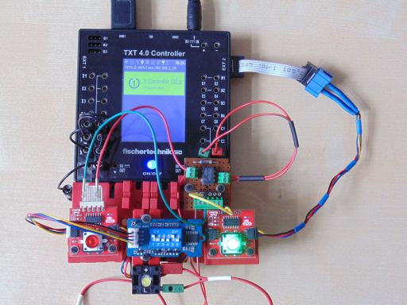
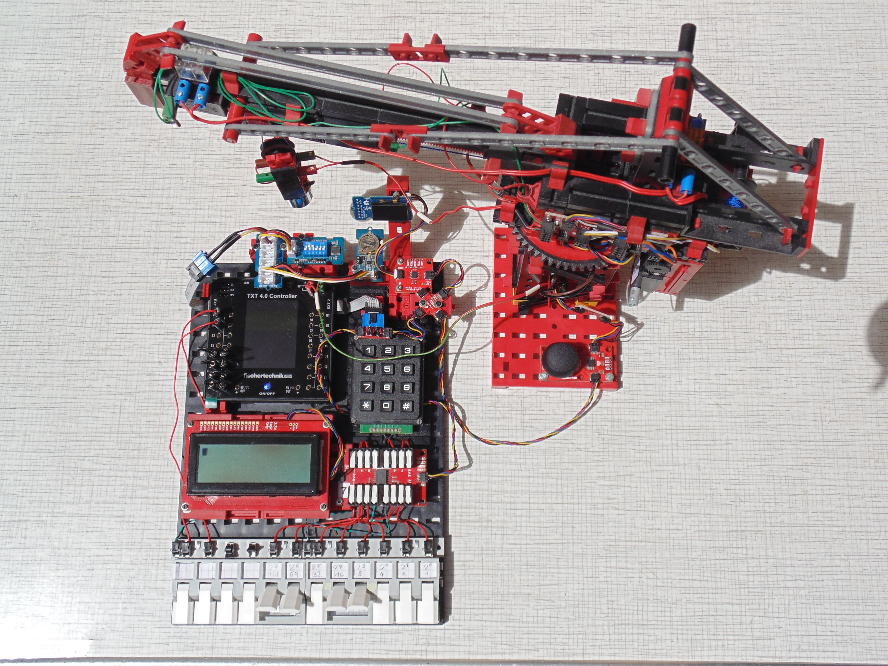

> Programmierbeispiele auf dieser Seite nutzen die I²C Blöcke von [ft_Controller_I2C](https://git.fischertechnik-cloud.com/i2c/ft_Controller_I2C)\
> [I²C Module](https://elssner.github.io/ft-Controller-I2C/#tabelle-1) |
[I²C Hardware, Software](https://elssner.github.io/ft-Controller-I2C/#ic) |
[I²C Programmierung, Blöcke](https://elssner.github.io/ft-Controller-I2C/#beschreibung-der-quellcodedateien-alphabetisch-geordnet)

### I²C Programmierbeispiele (Blöcke) für ROBO Pro Coding und fischertechnik TXT 4.0 und RX Controller.

Alle Beispiele sind plattformunabhängig programmiert und für TXT 4.0 und RX Controller geeignet. In der ROBO Pro Coding Projektkonfiguration kann jedes Projekt einfach für den anderen Controller konvertiert werden.\
Der BT Smart Controller hat keine I²C Anschlüsse und ist nicht verwendbar.

Beim RX Controller ist die Anzahl der I²C-Adressen begrenzt. Zu viele I²C Module gleichzeitig am I²C-Bus werden dann nicht erkannt. Ein [I²C Multiplexer](#qwiicmux_rxpy) kann das Problem lösen.\
Beim TXT 4.0 Controller sind solche Einschränkungen nicht bekannt.

###### Tabelle 1:

Quellcodedatei|kurze Beschreibung
---|---
[qwiicbutton_int](#qwiicbutton_intpy)|2 I²C Buttons, /INT Ereignis, Optokoppler
[qwiicmotor_joystick](#qwiicmotor_joystickpy)|2 oder 4 Motoren mit Joystick steuern
[qwiicmux_rx](#qwiicmux_rxpy)|RX mit I²C Multiplexer, 10 I²C Module

<!--

#### Hauptprogramm in der App ROBO Pro Coding
* Mit Drahtbrücken an den Eingängen `I8 I7 I6 I5` kann der Start eines bestimmten Programmierbeispiels codiert werden. [Tabelle 2](#tabelle-2) zeigt die Codierung der Eingänge.
* Beispiel 0 ruft **i2c_scan** auf und zeigt die gefundenen I²C-Adressen in der Konsole an.
* Beispiel 13 **qlaser_konsole** zeigt Werte vom Distance Sensor in der Konsole an.
* Alle anderen Beispiele können nach Übertragung des Programms auf dem Controller (ohne Verbindung zur App) gestartet werden. Nur Drahtbrücken umstecken und Programm starten.

###### Tabelle 2:
* Codierung der Eingänge, um ein Beispiel vom Hauptprogramm zu starten.
* Name des Beispiel-Blocks und aufgerufende I²C Quellcodedateien aus [Tabelle 1](#tabelle-1).

`I8`|`I7`|`I6`|`I5`|Beispiel (Block)|Quellcodedateien, I²C Module
---|---|---|---|---|---
`0`|`0`|`0`|`0`|**i2c_scan**|[i2cCode](#i2ccodepy) (immer erforderlich)
`0`|`0`|`0`|`1`|**grovelcd_rtc**|[lcd16x2](#lcd16x2py), [rtc](#rtcpy)
`0`|`0`|`1`|`0`|**grovelcd_keyboard**|[lcd16x2](#lcd16x2py), [keyboard](#keyboardpy)
`0`|`0`|`1`|`1`|**grovelcd_dipswitch**|[lcd16x2](#lcd16x2py), [dipswitch](#dipswitchpy)
`0`|`1`|`0`|`0`|**qlcd_rtc_keypad**|[qwiiclcd](#qwiiclcdpy), [rtc](#rtcpy), [qwiickeypad](#qwiickeypadpy)
`0`|`1`|`0`|`1`|**qlcd_gpio_keypad**|[qwiiclcd](#qwiiclcdpy), [qwiicgpio](#qwiicgpiopy), [qwiickeypad](#qwiickeypadpy)
`0`|`1`|`1`|`0`|**qlcd_joystick**|[qwiiclcd](#qwiiclcdpy), [qwiicjoystick](#qwiicjoystickpy)
`0`|`1`|`1`|`1`|**qbutton2_queue**|[qwiicbutton](#qwiicbuttonpy)
`1`|`0`|`0`|`0`|**oled_zeichnen**|[oled](#oledpy), [oled_geometrie](#oled_geometriepy)
`1`|`0`|`0`|`1`|**oled_eeprom_copy**|[oled](#oledpy), [qwiiceeprom](#qwiiceeprompy)
`1`|`0`|`1`|`0`|**oled_eeprom_rtc**|[oled](#oledpy), [oled_geometrie](#oled_geometriepy), [qwiiceeprom](#qwiiceeprompy), [rtc](#rtcpy)
`1`|`0`|`1`|`1`|**oled2_systemtime**|[oled](#oledpy), [oled_geometrie](#oled_geometriepy), [advanced](#advancedpy)
`1`|`1`|`0`|`0`|**qlcd_qus_qir**|[qwiiclcd](#qwiiclcdpy), [s_qwiicultrasonic](#s_qwiicultrasonicpy), [s_qwiicinfrared](#s_qwiicinfraredpy)
`1`|`1`|`0`|`1`|**qlaser_konsole**|[s_qwiiclaser](#s_qwiiclaserpy)
`1`|`1`|`1`|`0`|**joy_2motoren**|[qwiicjoystick](#qwiicjoystickpy), [qwiicmotor](#qwiicmotorpy)
`1`|`1`|`1`|`1`|**joy_4motoren**|[qwiicjoystick](#qwiicjoystickpy), [qwiicmotor](#qwiicmotorpy)

#### Beispiele.py
* Programmierbeispiele zeigen die Nutzung mehrerer I²C Module gleichzeitig.
* Alle Programme sind für TXT 4.0 und (nach Projekt konvertieren) RX Controller geeignet.

###### Tabelle 3:

n|Beispiel (Block)|Beschreibung
---|---|---
0|**i2c_scan**|I²C-Adressen der angeschlossenen Module in Konsole
1|**grovelcd_rtc**|Grove LCD 16x2 zeigt Uhrzeit und Datum an.
2|**grovelcd_keyboard**|Grove LCD 16x2 schreiben mit Card Keyboard (50 Tasten).
3|**grovelcd_dipswitch**|Grove LCD 16x2 mit 6 DIP Schaltern oder 5-Way Switch.
4|**qlcd_rtc_keypad**|Qwiic LCD 16x2 oder 20x4 Uhr stellen und anzeigen.
5|**qlcd_gpio_keypad**|Qwiic LCD 16x2 oder 20x4 8 Bit Zeichencode Eingabe mit GPIO.
6|**qlcd_joystick**|Qwiic LCD 16x2 oder 20x4 zeigt Joystick Positionen an.
7|**qbutton2_queue**|2 Qwiic Buttons mit LED, FIFO in Konsole anzeigen.
8|**oled_zeichnen**|OLED 128x64 oder 128x128 Linien und Kreise anzeigen.
9|**oled_eeprom_copy**|OLED 128x64 oder 128x128 Zeichensatz aus EEPROM anzeigen.
10|**oled_eeprom_rtc**|OLED 128x64 oder 128x128 Datum, Uhrzeit digital und analog.
11|**oled2_systemtime**|2 OLED Displays, verschiedener Inhalt, Analoguhr System-Zeit.
12|**qlcd_qus_qir**|Qwiic LCD zeigt 2 Sensoren (Abstand und Nähe) an.
13|**qlaser_konsole**|Laser Distance Sensor in Konsole anzeigen.
14|**joy_2motoren**|2 Motoren (1 Modul) mit Joystick steuern.
15|**joy_4motoren**|4 Motoren (2 Module) mit Joystick umschalten und steuern.

-->

### Beschreibung der Beispiele (Quellcodedateien alphabetisch geordnet)
Inhaltsverzeichnis: [Tabelle 1](#tabelle-1)

#### qwiicbutton_int.py

* Quellcodedatei: **[qwiicbutton](../#qwiicbuttonpy)**
* [I²C Module mit Hardware Interrupt](../#ic-module-mit-hardware-interrupt)
* Laden von fischertechnik GitLab: [I2C_Buttons_DipSwitch_Relay](https://git.fischertechnik-cloud.com/i2c/I2C_Buttons_DipSwitch_Relay)

I²C Module, die eine Eingabe machen wie Buttons, müssen normalerweise in einer dauerhaft Schleife ständig über den I²C-Bus abgefragt werden, ob sich der Zustand geändert hat. 
Solche I²C Module haben oft einen zusätzlichen (Löt-) Interrupt-Pin /INT, der außerhalb vom I²C-Bus extra verdrahtet werden kann.

Die I²C Module haben 3,3V Logik, die fischertechnik Controller aber 9V Logik. Um die /INT Leitungen an einen Controller Input anzuschließen, wird ein Optokoppler empfohlen.
Der Optokoppler hat am Ausgang einen Fototransistor. Die Controller können am Input einen Fototransistor digital hell/dunkel abfragen.

Somit kann beim **TXT 4.0 Controller**  ausgelöst werden.

Programmierbeispiel für Interrupt von 2 Buttons über Optokoppler (3,3V -> 9V Logik) und Ereignis `Starte jedes mal ist Fototransistor hell`.
[Beispiel Projekt](https://git.fischertechnik-cloud.com/i2c/I2C_Buttons_DipSwitch_Relay) | [Foto](https://git.fischertechnik-cloud.com/i2c/I2C_Buttons_DipSwitch_Relay/-/blob/master/fotos/DSC00417.JPG)

Block **buttons_polling**
* Beispiel ohne Interrupt kann beim Programmstart aufgerufen werden.
* Buttons werden in dauerhaft Schleife abgefragt (polling).

Block **buttons_interrupt**
* Beispiel mit Interrupt kann beim Programmstart aufgerufen werden.
* Konfiguriert Interrupt *when_clicked*.
* Buttons werden nur bei aktiver /INT Leitung abgefragt, im folgenden Block.

Block **buttons_event**
* Block muss in Ereignis `Starte jedes mal ist Fototransistor hell` eingefügt werden.
* Sucht den geklickten Button und setzt dessen /INT zurück.

#### qwiicbutton_queue.py
> Button speichert bei PRESSED 8 und bei CLICKED 16 Zeitstempel (32 Bit Millisekunden) in QUEUE / FIFO.
> Diese Quellcodedatei wird nur benötigt, wenn die Zeitstempel ausgewertet werden sollen.

Block **button_clicked_queue_empty** (i2c_addr)\
Block **button_clicked_queue_full** (i2c_addr)\
Block **button_pressed_queue_empty** (i2c_addr)\
Block **button_pressed_queue_full** (i2c_addr)
* Gibt True zurück, wenn das entsprechende Status Bit gesetzt ist.

Block **button_print_queue** (i2c_addr)
* Zeigt Status, neuesten und ältesten Zeitstempel aus der PRESSED_QUEUE und CLICKED_QUEUE in der Konsole an.

Block **button_pop_clicked_queue** (i2c_addr)\
Block **button_pop_pressed_queue** (i2c_addr)
* Gibt den ältesten Zeitstempel (32 Bit Millisekunden) zurück und löscht diesen aus der QUEUE.

#### qwiiceeprom.py
###### [SparkFun Qwiic EEPROM Breakout - 512Kbit](https://www.sparkfun.com/products/18355)
Block **read_eeprom** (adr16Bit, read_length) : Liste der Bytes
* *adr16Bit*: 0x0000..0xFFFF
* *read_length*: Anzahl zu lesender Bytes (**nicht** auf 32 begrenzt).
* Die zurück gegebene Liste kann mit `Datenstrukturen`**in der Liste** gelesen werden.

Block **test_eeprom** ()
* Testet, ob der ASCII Zeichensatz im EEPROM programmiert ist.
* Speicherbereich der 96 ASCII Zeichen F900-FBFF kann im Code geändert werden.
* Schreibt 6*128 Byte aus Speicherbereich in Konsole: ['0x3e', '0x51', '0x49', '0x45'].

#### qwiicgpio.py
###### [SparkFun Qwiic GPIO](https://www.sparkfun.com/products/17047)
> 3,3 Volt Logik; 16 Klemmen: 8 GPIO-Pins, 4 GND, 3 3V3, 1 /INT\
Mit /INT kann bei Zustandsänderung ein [Hardware Interrupt](#ic-module-mit-hardware-interrupt) ausgelöst werden.

Block **set_gpio** (io, inv)
* Muss einmal beim Start aufgerufen werden.
* Beide Parameter *io*, *inv*: String mit 8 Binärziffern (0 oder 1).
* Jede Binärziffer (Bit) ist einem von 8 GPIO-Pins zugeordnet.
* *io* CONFIGURATION Bit: 0=output Pin; 1=input Pin
* *inv* INVERSION Bit: 0=original polarity; 1=inverted
* INVERSION wirkt nur auf input Pins → Pin an GND → logische 1
* Beispiel:\
**set_gpio**('00000011', '00000000'): 6 output und 2 input\
**set_gpio**('11111111', '11111111'): alle 8 Pins input inverted
* ACHTUNG! GPIO INPUT und OUTPUT hat 3,3 Volt Pegel!

Block **read_gpio** () : Byte
* Gibt 1 Byte zurück, 1 Bit pro GPIO Pin.
* An input Pins max. 3,3 Volt Spannung anschließen!
* Taster schalten Pin an GND; Pull Up Widerstände (10 kOhm) an 3V3 erforderlich.

Block **write_gpio** (byte)
* *byte*: Schaltet 8 GPIO Pins, die als 0=output konfiguriert sind.
* Bit=0: aus (0 Volt); Bit=1: an (3,3 Volt)

#### qwiicjoystick.py
###### [SparkFun Qwiic Joystick](https://www.sparkfun.com/products/15168)
Block **read_joystick** ()
* <ins>Muss am Anfang jeder Schleife aufgerufen werden.</ins>
* Liest alle Joystick Register über den I²C-Bus in Variable JOYSTICK_BUFFER.

> <ins>Die folgenden Blöcke **get** lesen nur die Variable, nicht den I²C-Bus.</ins>

Block **get_joystick_x** () : Byte\
Block **get_joystick_y** () : Byte
* Gibt 1 Byte zurück mit der Stellung des Joystick in X bzw. Y Richtung.
* Mittelstellung ist 128, geringe Abweichung durch Hardware Toleranz.
* Endstellung unten bzw. links = 0; oben bzw. rechts = 255.

Block **get_joystick_button_position** () : Boolean
* Gibt True zurück, wenn der Joystick jetzt gerade gedrückt ist.

Block **get_joystick_button_onoff** () : Boolean
* Wechselt False / True bei jedem Drücken des Joystick.

#### qwiickeypad.py
###### [SparkFun Qwiic Keypad - 12 Tasten](https://www.sparkfun.com/products/15290)
> Mit /INT kann bei gedrückter Taste ein [Hardware Interrupt](#ic-module-mit-hardware-interrupt) ausgelöst werden.

Block **read_keypad** () : Byte
* Gibt 0 zurück wenn keine Taste gedrückt, sonst ASCII-Code der gedrückten Taste.
* Keypad hat 12 Tasten: '0'=48 ... '9'=57 .. '#'=35 .. '*'=42

#### qwiiclcd.py
###### [SparkFun Qwiic 20x4 SerLCD - RGB Backlight](https://www.sparkfun.com/products/16398) | [SparkFun Qwiic 16x2 SerLCD - RGB Backlight](https://www.sparkfun.com/products/16396)
Block **init_qlcd** ()
* Muss einmal beim Start aufgerufen werden.
* Im Code kann die Größe des Display 16x2 oder 20x4 (COLS x ROWS) konfiguriert werden.

Block **write_qtext** (row, col, end, text, right)
* Schreibt an eine bestimmte Position Text mit fester Länge.
* *row*: Zeile 0..3; *col*: Spalte 0..19; *end*: Spalte 0..19 (letztes Zeichen)
* *text*: Text, alle Datentypen werden mit str() konvertiert.
* *right*: None oder False=linksbündig; True=rechtsbündig\
Text wird mit Leerzeichen auf die Länge (end-col)+1 aufgefüllt.
* Parameter außer *text* können weg gelassen werden (None).\
default: *row*=0; *col*=0; *end*=COLS-1; right=False

Block **clear_qscreen** ()
* Löscht das LCD Display.

Block **set_qcursor** (row, col)
* Set Cursor für writeQLCD oder wenn Cursor sichtbar ist oder blinkt.
* *row*: Zeile 0..3; *col*: Spalte 0..19
* Parameter optional, default: *row*=0; *col*=0

Block **write_qlcd** (text)
* Schreibt *text* an aktuelle Cursorposition.
* Alle Datentypen werden mit str() konvertiert.
* Schreibt auf nächster Zeile weiter, max. Länge 32 Zeichen.

Block **set_qdisplay** (display_on, cursor_on, blink_on)
* Alle Parameter Boolean: False oder True.
* Schaltet das Display, Cursor und blinkenden Cursor an und aus.

#### qwiicmotor.py
###### [SparkFun Qwiic Motor Driver](https://www.sparkfun.com/products/15451)
Block **init_motor** (i2c_addr)
* Für jedes Motor-Modul einmal beim Start aufrufen (mit entsprechender *i2c_addr*).
* Parameter *i2c_addr* kann weg gelassen werden, default: 0x5D.
* 1 Modul steuert 2 Motoren 9V, mehrere Module können gleichzeitig angeschlossen werden.
* 10 I²C-Adressen mit Lötbrücken einstellbar: 0x58..0x61.

Block **set_motor_i2c** (i2c_addr)
* Ändert die I²C-Adresse für die folgenden Funktionen auf ein bestimmtes Motor-Modul.
* Wird nur bei mehreren angeschlossenen Qwiic Motor-Modulen benötigt.

Block **enable_motor** (on:Boolean)
* *on* schaltet Motor Power: True=an; False=aus (für 1 Modul = 2 Motoren).
* Power für H-Bridge soll bei längerem Stillstand aus geschaltet werden, um Energie zu sparen.

Block **drive_motor_a** (speed:Byte)\
Block **drive_motor_b** (speed:Byte)
* *speed* 0..128..255 Motor Drehzahl und Richtung.
* *speed* ist optional, default=128 (Stillstand).
* 0 max. rückwärts | ← 128 Stop → | 255 max. vorwärts

#### qwiicmux.py
###### [SparkFun Qwiic Mux Breakout - 8 Channel (TCA9548A)](https://www.sparkfun.com/products/16784)
> I²C Multiplexer

Block **mux** (channel)
* *channel*: 0..7 schaltet genau einen Kanal ein. Jeder andere Wert schaltet alle aus.

Block **mux_write** (byte)
* *byte*: 0..255 für jedes Bit wird der entsprechende Kanal ein geschaltet.

Block **mux_read**
* Gibt ein Byte mit den gesetzen Bits der eingeschalteten Kanäle zurück.

#### qwiicmux_rx.py
> Beispiel 10 I²C Module gleichzeitig mit Multiplexer. Funktioniert am RX Controller, der nur 2 bis 3 I²C-Adressen gleichzeitig erkennt.
> [Beispiel Projekt](https://git.fischertechnik-cloud.com/i2c/I2C_Multiplexer) | [Foto](https://git.fischertechnik-cloud.com/i2c/I2C_Multiplexer/-/blob/master/fotos/DSC00409.JPG)

Block **qmux_rx1**
* Beispiel kann beim Programmstart aufgerufen werden.
* 3 Displays, EEPROM, Keypad, GPIO, RTC, Speicherkarte, Ultraschallsensor und Multiplexer.

#### qwiicopenlog.py
###### [SparkFun Qwiic OpenLog](https://www.sparkfun.com/products/15164)
> Lesen und Schreiben von Dateien auf microSD card 64MB .. 32GB, FAT16 oder FAT32.
> <ins>Dateinamen sollen im Format 8.3, nur ASCII Zeichen und Großbuchstaben enthalten.</ins>

Block **log_init**
* Muss <ins>nicht</ins> beim Start aufgerufen werden.
* Zeigt den Status binär und bei Fehler eine Meldung in der Konsole an.

Block **log_status**
* Gibt das Status Byte zurück. siehe → [Register Map](https://cdn.sparkfun.com/assets/learn_tutorials/8/6/5/newthing.JPG)

Block **log_dir** (filename, count)
* Gibt eine Liste mit Dateinamen zurück. *count* ist die maximale Anzahl.
* *filename* kann Platzhalter wie z.B. \*.\* oder \*.TXT enthalten.

Block **log_size** (filename)
* Gibt die Größe der Datei zurück.

Block **log_read** (filename, size)
* Gibt ein bytearray mit dem Inhalt der Datei zurück.
* *filename* im Format 8.3 und Großbuchstaben.
* *size* ist die maximale Länge. bytearray ist kürzer, wenn die Datei kleiner ist.
* Blöcke zum Umwandeln Bytes in Text sind in [advanced](#advancedpy).

Block **log_write** (filename, bu)
* Schreibt die Bytes aus *bu* in die Datei. Anhängen wenn Datei existiert.
* *filename* im Format 8.3 und Großbuchstaben.
* *bu* kann auch eine Liste sein, darf aber nur Bytes (0..255) enthalten.
* Blöcke zum Umwandeln Text in Bytes sind in [advanced](#advancedpy).

Block **log_test**
* Schreibt die Zeichencodes 32 bis 127 in die Datei ASCII.TXT.
* Aller 16 Byte wird CR (=13) und LF (=10) eingefügt.

Block **log_remove** (filename)
* Löscht eine oder mehrere Dateien.
* Gibt Anzahl der gelöschten Dateien zurück.

Block **log_sync**
* Kann vor dem Entfernen der Speicherkarte aufgerufen werden, muss aber nicht.

#### qwiicrelay.py
###### [SparkFun Qwiic Single Relay](https://www.sparkfun.com/products/15093)
> Strom für Relais kommt aus dem 3,3 Volt I²C-Bus!

Block **relay** (on:Boolean)
* *on* schaltet Relais: True=an; False=aus.
* I2C_ADDRESS kann im Code geändert werden, default 0x18.

#### rtc.py
###### [Grove - High Precision RTC (Real Time Clock)](https://wiki.seeedstudio.com/Grove_High_Precision_RTC)

##### Uhr stellen

Block **rtc_write** (index, int8)
* Stellt die Uhr. Ändert ein bestimmtes Register *index*.
* `0`Seconds, `1`Minutes, `2`Hours, `3`Days, `4`Weekdays, `5`Months, `6`Years
* *int8*: 0..59 Byte wird in BCD konvertiert und im RTC-Modul gespeichert. 

Block **rtc_set** (key_code) : keyString
* Stellt die Uhr mit 5 ASCII Zeichen-Codes von Keypad oder Keyboard.
* Muss 5 mal mit ASCII Code aufgerufen werden, gibt den zusammengesetzten String zurück.\
  *1. Zeichen:* `*` neu, *2. Zeichen:* Register `0..6`,\
  *3. und 4. Zeichen:* 2 Ziffern dezimal `00..59`, *5. Zeichen:* `#` speichern
* Wenn 5 Zeichen gültig sind, wird mit **write_rtc** das Register geändert.
* Beispiel: `*120#`setzt Minute auf 20; `*401#` Montag; `*000#` Sekunde 0.

##### Uhr lesen

Block **rtc_read** ()
* <ins>Muss am Anfang jeder Schleife aufgerufen werden.</ins>
* Liest 7 Byte in Variable RTC_BUFFER.
* BCD codiert: 4 Bit pro Ziffer, Bit `7654` Zehner, Bit `3210` Einer, Jahr 2-stellig

> <ins>Die folgenden Blöcke **get** lesen nur die Variable, nicht den I²C-Bus.</ins>

Block **get_rtc** (index) : Byte
* Liest 1 Byte aus Variable RTC_BUFFER[*index*] zu dezimal konvertiert.
* `0`Seconds, `1`Minutes, `2`Hours, `3`Days, `4`Weekdays, `5`Months, `6`Years

Block **get_time_string** () : String 8 Zeichen
* Liest Zeit aus Variable RTC_BUFFER: `HH:mm:ss`.

Block **get_date_string** () : String 10 Zeichen
* Liest Datum aus Variable RTC_BUFFER: `dd.MM.20yy`.

Block **get_weekday** () : String 2 Zeichen
* Liest Wochentag aus RTC_BUFFER: ['So', 'Mo', 'Di', 'Mi', 'Do', 'Fr', 'Sa'].

#### s_co2.py
###### [Calliope mini CO2 Sensor - SCD40](https://calliope.cc/calliope-mini/erweiterungen/calliope-co2-sensor)
> Sensor hat keine Pull Up Widerstände, deshalb immer mit anderen Modulen anschließen, die welche haben.
> Blockiert oft den I²C-Bus, dann Strom aus und einschalten. [Data Sheet](https://sensirion.com/media/documents/E0F04247/631EF271/CD_DS_SCD40_SCD41_Datasheet_D1.pdf#page=8)

Block **init_co2** (factory_reset)
* Muss einmal beim Start aufgerufen werden.
* *factory_reset*: True Reset aller Register.
* Ruft **start_continuous_measurement** auf.

Block **start_continuous_measurement**
* Startet die Messungen (etwa aller 5 Sekunden).

Block **stop_continuous_measurement**
* Beendet die Messungen. Immer abschalten wenn nicht benötigt, um Strom zu sparen.

Block **get_data_ready_status**
* Gibt True zurück, wenn ein neuer Messwert bereit ist. Etwa aller 5 Sekunden.

Block **read_measurement**
* Testet **get_data_ready_status**, wenn True werden die Messwerte in interne Variablen gelesen.
* Sonst bleiben die internen Variablen unverändert.
* Muss einmal in jeder Schleife (aller 5s) aufgerufen werden, um die Variablen zu aktualisieren.

> Die folgenden Blöcke **get** lesen nur die Variable, nicht den I²C-Bus.

Block **get_co2**\
Block **get_temperature**\
Block **get_relative_hunidity**
* Gibt CO² (Kohlendioxid), Temperatur °C oder relative Luftfeuchtigkeit zurück.

#### s_qwiicinfrared.py
###### [SparkFun Qwiic Proximity Sensor - 20cm, VCNL4040](https://www.sparkfun.com/products/15177)
> Nähe Sensor misst keinen genauen Abstand, nur ob ein Objekt näher als 20cm kommt (Seifenspender). Kann Interrupt auslösen.
> [VCNL4040_Datasheet](https://cdn.sparkfun.com/assets/2/3/8/f/c/VCNL4040_Datasheet.pdf#page=9)

Block **init_qinfrared**
* Muss einmal beim Start aufgerufen werden.
* Initialisiert die Konstanten (Register Nummern) und schaltet Sensor an **power_on_proximity**.

Block **power_on_proximity** (on)
* *on*: True schaltet Sensor an, False schaltet aus.
* Infrarot LED nimmt Strom vom 3,3V I²C-Bus (50..200mA). Aus schalten wenn nicht benutzt.

Block **get_proximity**
* Gibt Nähe zurück (16 Bit): 0..1 wenn nichts in der Nähe (20 cm), wird größer je näher.

#### s_qwiiclaser.py
###### [SparkFun Qwiic Distance Sensor - 4 Meter, VL53L1X](https://www.sparkfun.com/products/14722) | [SparkFun Qwiic Distance Sensor - 1.3 Meter, VL53L4CD](https://www.sparkfun.com/products/18993)
Block **init_qlaser**
* Muss einmal beim Start aufgerufen werden.
* Initialisiert den Sensor und wartet bis bereit (check_for_data_ready).

Block **read_distance_cm**
* Gibt Distance in cm (mit 1 Stelle hinter dem Komma) zurück. Genauigkeit ist mm.
* Ruft *start_ranging*, *get_distance*, *stop_ranging* nacheinander auf.

Block **start_ranging**
* Startet die Messungen mit Default Parametern. Kann konfiguriert werden. 

Block **stop_ranging**
* Beendet die Messungen.

Block **get_distance**
* Gibt Distance in mm zurück (16 Bit int). Ranging muss vorher gestartet werden.

#### s_qwiicultrasonic.py
###### [SparkFun Qwiic Ultrasonic Distance Sensor - HC-SR04](https://www.sparkfun.com/products/17777)
> Der Ultraschallsensor wird auch von Controllern an einem Pin betrieben. Die Genauigkeit hängt vom Prozessor ab, es kommen oft ungültige Werte.
> Der I²C Sensor hat einen eigenen Prozessor für die Ultraschall Messung, es wird nur der aktuelle Wert in mm ausgelesen.
> Dieses Modul erfasst außerdem einen großen Winkel. So erkennen Modelle auch Hindernisse schräg, oben und unten und fahren nicht dagegen. 

Block **change_ultrasonic_i2c** (old_i2c, new_i2c)
> Default I²C-Adresse ist 0x00. Damit funktioniert der Sensor. 0x00 gilt aber als reserviert und sollte geändert werden.

* Wenn *old_i2c* weg gelassen wird, gilt 0x00. Wenn *new_i2c* weg gelassen wird, gilt 0x09.
* Gültige Werte für *new_i2c*: 0x02 .. 0x7F. Empfohlen: 0x09 .. 0x77.
* Änderung bleibt beim Ausschalten erhalten.

Block **read_ultrasonic_mm**
* Gibt Distance in mm zurück (16 Bit int).
* I²C-Adresse ist 0x09. Kann im Code geändert werden.\
(Z.B. auf 0x00, um den Sensor mit der Original Adresse zu benutzen.)

#### wattmeter.py
###### [DFRobot Gravity: I2C Digital Wattmeter SKU: SEN0291](https://www.dfrobot.com/product-1827.html)
> Misst max. 26V, 8A. 4 I²C-Adressen, bis 4 Wattmeter gleichzeitig auslesen.

Block **init_wattmeter**
* Muss einmal beim Start aufgerufen werden.
* Im Code kann calibration_value für genauere Strom Messung angepasst werden.
* Spannung kann nicht kalibriert werden.

Block **wattmeter_volt**
* Gibt Spannung in V zurück, mit 2 Dezimalstellen.

Block **wattmeter_milliampere**
* Gibt Strom in mA zurück, integer kann auch negativ sein.

Block **wattmeter_milliwatt**
* Gibt Leistumg in mW zurück. Ist ungenau und eigentlich überflüssig, Datenblatt lesen.

### Foto

10 Module gleichzeitig am TXT 4.0 Controller I²C-Bus
* 0x03 Grove - 6-Position DIP Switch
* 0x20 SparkFun Qwiic Joystick
* 0x27 SparkFun Qwiic GPIO
* 0x3c Grove - OLED Yellow&Blue Display 0.96(SSD1315) 128x64 Pixel
* 0x4b SparkFun Qwiic Keypad - 12 Tasten
* 0x50 SparkFun Qwiic EEPROM Breakout - 512Kbit
* 0x51 Grove - High Precision RTC (Real Time Clock)
* 0x5d SparkFun Qwiic Motor Driver, 2 Motoren XS 9V
* 0x5e SparkFun Qwiic Motor Driver, 1 Motor XS 9V, 1 Elektromagnet
* 0x72 SparkFun Qwiic 20x4 SerLCD - RGB Backlight
* Grove - I2C Hub(6 Port)
* Qwiic Cable - Grove Adapter (100mm)
* SparkFun Qwiic Cable Kit
* SparkFun Qwiic MultiPort
* SparkFun Qwiic Adapter
* Pfosten-Steckverbinder Rastermaß: 2.54 mm Polzahl Gesamt: 6
* Beim Adapter löten gut isolieren, Spannung >3,3V am I²C-Bus zerstört den Controller!
* [Schrumpfschlauch](https://www.conrad.de/de/p/tru-components-t1904ca026-schrumpfschlauch-ohne-kleber-schwarz-1-50-mm-0-80-mm-schrumpfrate-2-1-1-m-2108776.html)
* [Modellbahn Tastenpult](https://www.tillig.com/Produkte/produktinfo-08211.html) 2 Stück\
2 Tasten GND an I1, I2; 8 Tasten GND an GPIO (Pull Up 10 KOhm an 3V3)

