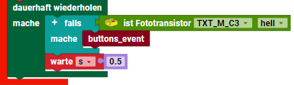

> Programmierbeispiele auf dieser Seite nutzen die I²C Blöcke von [ft_Controller_I2C](https://git.fischertechnik-cloud.com/i2c/ft_Controller_I2C)\
> [I²C Module](https://elssner.github.io/ft-Controller-I2C/#tabelle-1) |
[I²C Hardware, Software](https://elssner.github.io/ft-Controller-I2C/#ic) |
[I²C Programmierung, Blöcke](https://elssner.github.io/ft-Controller-I2C/#beschreibung-der-quellcodedateien-alphabetisch-geordnet)

### I²C Programmierbeispiele (Blöcke) für ROBO Pro Coding und fischertechnik TXT 4.0 und RX Controller.

Alle Beispiele sind plattformunabhängig programmiert und für TXT 4.0 und RX Controller geeignet. In der ROBO Pro Coding Projektkonfiguration kann jedes Projekt einfach für den anderen Controller konvertiert werden.\
Der BT Smart Controller hat keine I²C Anschlüsse und ist nicht verwendbar.

Beim RX Controller ist die Anzahl der I²C-Adressen begrenzt. Zu viele I²C Module gleichzeitig am I²C-Bus werden dann nicht erkannt. Ein [I²C Multiplexer](#qwiicmux_rxpy) kann das Problem lösen.\
Beim TXT 4.0 Controller sind solche Einschränkungen nicht bekannt.

###### Tabelle 1:

Quellcodedatei|kurze Beschreibung
---|---
[qwiicbutton_int](#qwiicbutton_intpy)|2 I²C Buttons, /INT Ereignis, Optokoppler
[qwiicmotor_joystick](#qwiicmotor_joystickpy)|2 oder 4 Motoren mit Joystick steuern
[qwiicmux_rx](#qwiicmux_rxpy)|RX mit I²C Multiplexer, 10 I²C Module

<!--

#### Hauptprogramm in der App ROBO Pro Coding
* Mit Drahtbrücken an den Eingängen `I8 I7 I6 I5` kann der Start eines bestimmten Programmierbeispiels codiert werden. [Tabelle 2](#tabelle-2) zeigt die Codierung der Eingänge.
* Beispiel 0 ruft **i2c_scan** auf und zeigt die gefundenen I²C-Adressen in der Konsole an.
* Beispiel 13 **qlaser_konsole** zeigt Werte vom Distance Sensor in der Konsole an.
* Alle anderen Beispiele können nach Übertragung des Programms auf dem Controller (ohne Verbindung zur App) gestartet werden. Nur Drahtbrücken umstecken und Programm starten.

###### Tabelle 2:
* Codierung der Eingänge, um ein Beispiel vom Hauptprogramm zu starten.
* Name des Beispiel-Blocks und aufgerufende I²C Quellcodedateien aus [Tabelle 1](#tabelle-1).

`I8`|`I7`|`I6`|`I5`|Beispiel (Block)|Quellcodedateien, I²C Module
---|---|---|---|---|---
`0`|`0`|`0`|`0`|**i2c_scan**|[i2cCode](#i2ccodepy) (immer erforderlich)
`0`|`0`|`0`|`1`|**grovelcd_rtc**|[lcd16x2](#lcd16x2py), [rtc](#rtcpy)
`0`|`0`|`1`|`0`|**grovelcd_keyboard**|[lcd16x2](#lcd16x2py), [keyboard](#keyboardpy)
`0`|`0`|`1`|`1`|**grovelcd_dipswitch**|[lcd16x2](#lcd16x2py), [dipswitch](#dipswitchpy)
`0`|`1`|`0`|`0`|**qlcd_rtc_keypad**|[qwiiclcd](#qwiiclcdpy), [rtc](#rtcpy), [qwiickeypad](#qwiickeypadpy)
`0`|`1`|`0`|`1`|**qlcd_gpio_keypad**|[qwiiclcd](#qwiiclcdpy), [qwiicgpio](#qwiicgpiopy), [qwiickeypad](#qwiickeypadpy)
`0`|`1`|`1`|`0`|**qlcd_joystick**|[qwiiclcd](#qwiiclcdpy), [qwiicjoystick](#qwiicjoystickpy)
`0`|`1`|`1`|`1`|**qbutton2_queue**|[qwiicbutton](#qwiicbuttonpy)
`1`|`0`|`0`|`0`|**oled_zeichnen**|[oled](#oledpy), [oled_geometrie](#oled_geometriepy)
`1`|`0`|`0`|`1`|**oled_eeprom_copy**|[oled](#oledpy), [qwiiceeprom](#qwiiceeprompy)
`1`|`0`|`1`|`0`|**oled_eeprom_rtc**|[oled](#oledpy), [oled_geometrie](#oled_geometriepy), [qwiiceeprom](#qwiiceeprompy), [rtc](#rtcpy)
`1`|`0`|`1`|`1`|**oled2_systemtime**|[oled](#oledpy), [oled_geometrie](#oled_geometriepy), [advanced](#advancedpy)
`1`|`1`|`0`|`0`|**qlcd_qus_qir**|[qwiiclcd](#qwiiclcdpy), [s_qwiicultrasonic](#s_qwiicultrasonicpy), [s_qwiicinfrared](#s_qwiicinfraredpy)
`1`|`1`|`0`|`1`|**qlaser_konsole**|[s_qwiiclaser](#s_qwiiclaserpy)
`1`|`1`|`1`|`0`|**joy_2motoren**|[qwiicjoystick](#qwiicjoystickpy), [qwiicmotor](#qwiicmotorpy)
`1`|`1`|`1`|`1`|**joy_4motoren**|[qwiicjoystick](#qwiicjoystickpy), [qwiicmotor](#qwiicmotorpy)

#### Beispiele.py
* Programmierbeispiele zeigen die Nutzung mehrerer I²C Module gleichzeitig.
* Alle Programme sind für TXT 4.0 und (nach Projekt konvertieren) RX Controller geeignet.

###### Tabelle 3:

n|Beispiel (Block)|Beschreibung
---|---|---
0|**i2c_scan**|I²C-Adressen der angeschlossenen Module in Konsole
1|**grovelcd_rtc**|Grove LCD 16x2 zeigt Uhrzeit und Datum an.
2|**grovelcd_keyboard**|Grove LCD 16x2 schreiben mit Card Keyboard (50 Tasten).
3|**grovelcd_dipswitch**|Grove LCD 16x2 mit 6 DIP Schaltern oder 5-Way Switch.
4|**qlcd_rtc_keypad**|Qwiic LCD 16x2 oder 20x4 Uhr stellen und anzeigen.
5|**qlcd_gpio_keypad**|Qwiic LCD 16x2 oder 20x4 8 Bit Zeichencode Eingabe mit GPIO.
6|**qlcd_joystick**|Qwiic LCD 16x2 oder 20x4 zeigt Joystick Positionen an.
7|**qbutton2_queue**|2 Qwiic Buttons mit LED, FIFO in Konsole anzeigen.
8|**oled_zeichnen**|OLED 128x64 oder 128x128 Linien und Kreise anzeigen.
9|**oled_eeprom_copy**|OLED 128x64 oder 128x128 Zeichensatz aus EEPROM anzeigen.
10|**oled_eeprom_rtc**|OLED 128x64 oder 128x128 Datum, Uhrzeit digital und analog.
11|**oled2_systemtime**|2 OLED Displays, verschiedener Inhalt, Analoguhr System-Zeit.
12|**qlcd_qus_qir**|Qwiic LCD zeigt 2 Sensoren (Abstand und Nähe) an.
13|**qlaser_konsole**|Laser Distance Sensor in Konsole anzeigen.
14|**joy_2motoren**|2 Motoren (1 Modul) mit Joystick steuern.
15|**joy_4motoren**|4 Motoren (2 Module) mit Joystick umschalten und steuern.

-->

### Beschreibung der Beispiele (Quellcodedateien alphabetisch geordnet)
Inhaltsverzeichnis: [Tabelle 1](#tabelle-1)

#### qwiicbutton_int.py

* Quellcodedateien: **[qwiicbutton](../#qwiicbuttonpy)**, **[dipswitch](../#dipswitchpy)**
* [I²C Module mit Hardware Interrupt](../#ic-module-mit-hardware-interrupt)
* Laden von fischertechnik GitLab: [I2C_Buttons_DipSwitch_Relay](https://git.fischertechnik-cloud.com/i2c/I2C_Buttons_DipSwitch_Relay)

I²C Module, die eine Eingabe machen wie Buttons, müssen normalerweise in einer dauerhaft Schleife ständig über den I²C-Bus abgefragt werden, ob sich der Zustand geändert hat.\
Solche I²C Module haben oft einen zusätzlichen (Löt-) Interrupt-Pin /INT, der außerhalb vom I²C-Bus extra verdrahtet werden kann.

Die I²C Module haben 3,3V Logik, die fischertechnik Controller aber 9V Logik. Um die /INT Leitungen an einen Controller Input anzuschließen, wird ein Optokoppler empfohlen.
Der Optokoppler hat am Ausgang einen Fototransistor. Die Controller können am Input einen Fototransistor digital hell/dunkel abfragen.

Somit kann der Fototransistor vom Optokoppler an einem beliebeigen Input I1 bis I8 und beim TXT 4.0 Controller auch an C1 bis C4 angeschlossen werden. 

Programmierbeispiel für Interrupt von 2 Buttons über Optokoppler (3,3V -> 9V Logik) und Ereignis `Starte jedes mal ist Fototransistor hell`.
[Beispiel Projekt](https://git.fischertechnik-cloud.com/i2c/I2C_Buttons_DipSwitch_Relay) | [Foto](https://git.fischertechnik-cloud.com/i2c/I2C_Buttons_DipSwitch_Relay/-/blob/master/fotos/DSC00417.JPG)

Block **buttons_polling**
* Beispiel ohne Interrupt kann beim Programmstart aufgerufen werden.
* Buttons werden in dauerhaft Schleife abgefragt (polling).

Block **buttons_interrupt**
* Beispiel mit Interrupt kann beim Programmstart aufgerufen werden.
* Konfiguriert Interrupt *when_clicked*.
* Buttons werden nur bei aktiver /INT Leitung abgefragt, im folgenden Block.

Block **buttons_event**

* Ereignis-Blöcke werden nur vom TXT 4.0 Controller unterstützt.
* Block **buttons_event** muss in das Fototransistor Ereignis eingefügt werden.

* Beim RX Controller kann der Block in einer dauerhaft Schleife abgefragt werden.

* Funktion sucht über den I²C-Bus den geklickten Button und setzt dessen /INT zurück.
* Die LED wird bei jedem Klick an und aus geschaltet.
* Der DIP Schalter steuert bei der grünen LED die Helligkeit, bei der roten die Blinkfrequenz.

#### qwiicmux_rx.py
> Beispiel 10 I²C Module gleichzeitig mit Multiplexer. Funktioniert am RX Controller, der nur 2 bis 3 I²C-Adressen gleichzeitig erkennt.
> [Beispiel Projekt](https://git.fischertechnik-cloud.com/i2c/I2C_Multiplexer) | [Foto](https://git.fischertechnik-cloud.com/i2c/I2C_Multiplexer/-/blob/master/fotos/DSC00409.JPG)

Block **qmux_rx1**
* Beispiel kann beim Programmstart aufgerufen werden.
* 3 Displays, EEPROM, Keypad, GPIO, RTC, Speicherkarte, Ultraschallsensor und Multiplexer.

### Foto

10 Module gleichzeitig am TXT 4.0 Controller I²C-Bus
* 0x03 Grove - 6-Position DIP Switch
* 0x20 SparkFun Qwiic Joystick
* 0x27 SparkFun Qwiic GPIO
* 0x3c Grove - OLED Yellow&Blue Display 0.96(SSD1315) 128x64 Pixel
* 0x4b SparkFun Qwiic Keypad - 12 Tasten
* 0x50 SparkFun Qwiic EEPROM Breakout - 512Kbit
* 0x51 Grove - High Precision RTC (Real Time Clock)
* 0x5d SparkFun Qwiic Motor Driver, 2 Motoren XS 9V
* 0x5e SparkFun Qwiic Motor Driver, 1 Motor XS 9V, 1 Elektromagnet
* 0x72 SparkFun Qwiic 20x4 SerLCD - RGB Backlight
* Grove - I2C Hub(6 Port)
* Qwiic Cable - Grove Adapter (100mm)
* SparkFun Qwiic Cable Kit
* SparkFun Qwiic MultiPort
* SparkFun Qwiic Adapter
* Pfosten-Steckverbinder Rastermaß: 2.54 mm Polzahl Gesamt: 6
* Beim Adapter löten gut isolieren, Spannung >3,3V am I²C-Bus zerstört den Controller!
* [Schrumpfschlauch](https://www.conrad.de/de/p/tru-components-t1904ca026-schrumpfschlauch-ohne-kleber-schwarz-1-50-mm-0-80-mm-schrumpfrate-2-1-1-m-2108776.html)
* [Modellbahn Tastenpult](https://www.tillig.com/Produkte/produktinfo-08211.html) 2 Stück\
2 Tasten GND an I1, I2; 8 Tasten GND an GPIO (Pull Up 10 KOhm an 3V3)

