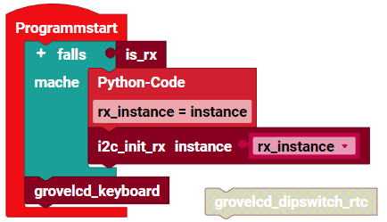

> ROBO Pro Coding I²C Blöcke von fischertechnik GitLab: [ft_Controller_I2C](https://git.fischertechnik-cloud.com/i2c/ft_Controller_I2C)\
> [I²C Module](https://elssner.github.io/ft-Controller-I2C/#tabelle-1) |
[I²C Hardware, Software](https://elssner.github.io/ft-Controller-I2C/#ic) |
[I²C Quellcodedateien, Blöcke](https://elssner.github.io/ft-Controller-I2C/#beschreibung-der-quellcodedateien-alphabetisch-geordnet)\
[I²C Programmierbeispiele im Überblick](../examples)

### lcd16x2_keyboard_rtc (Text schreiben mit Tastatur, Uhr, DIP Schalter)

* [Grove - LCD Display 16x2 Zeichen](https://wiki.seeedstudio.com/Grove-16x2_LCD_Series)
* [Grove - 6-Position DIP Switch](https://wiki.seeedstudio.com/Grove-6-Position_DIP_Switch)
* [M5Stack Card Keyboard](https://docs.m5stack.com/en/unit/cardkb_1.1)
* [Grove - RTC (Real Time Clock)](https://wiki.seeedstudio.com/Grove_High_Precision_RTC)

Block **grovelcd_dipswitch_rtc**
* Quellcodedateien, I²C Module: **[i2cCode](../#i2ccodepy)**, **[lcd16x2](../#lcd16x2py)**, **[dipswitch](../#dipswitchpy)**, **[rtc](../#rtcpy)**
* Laden von fischertechnik GitLab: [I2C_LCD_RTC_Keyboard_Dipswitch](https://git.fischertechnik-cloud.com/i2c/I2C_LCD_RTC_Keyboard_Dipswitch)

\
Zum Vergrößern auf das Bild klicken.

* Zeigt Datum und Uhrzeit von RTC Modul auf dem LCD Display an.
* Zeigt die Schalterstellung vom DIP Schalter als 6 Nullen oder Einsen an.
* Aktualisiert jede Sekunde.

Block **grovelcd_keyboard**
* Quellcodedateien, I²C Module: **[i2cCode](../#i2ccodepy)**, **[lcd16x2](../#lcd16x2py)**, **[keyboard](../#keyboardpy)**
* Laden von fischertechnik GitLab: [I2C_LCD_RTC_Keyboard_Dipswitch](https://git.fischertechnik-cloud.com/i2c/I2C_LCD_RTC_Keyboard_Dipswitch)

\
Zum Vergrößern auf das Bild klicken.

* Mit der Tastatur kann Text in das LCD Display geschrieben werden.
* ENTER: neue Zeile.
* Zurück-Taste: letztes Zeichen löschen.
* Alle anderen Zeichen werden angezeigt, bis die Zeile voll ist (16 Zeichen).

