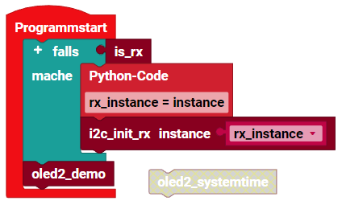

> ROBO Pro Coding I²C Blöcke von fischertechnik GitLab: [ft_Controller_I2C](https://git.fischertechnik-cloud.com/i2c/ft_Controller_I2C)\
> [I²C Module](https://elssner.github.io/ft-Controller-I2C/#tabelle-1) |
[I²C Hardware, Software](https://elssner.github.io/ft-Controller-I2C/#ic) |
[I²C Quellcodedateien, Blöcke](https://elssner.github.io/ft-Controller-I2C/#beschreibung-der-quellcodedateien-alphabetisch-geordnet)\
[I²C Programmierbeispiele im Überblick](../examples)

### oled_text_analoguhr (Analoguhr, Text anzeigen, Zeichensatz aus EEPROM)

Zwei (gleiche oder verschiedene) OLED Displays können gleichzeitig an den I²C-Bus angeschlossen werden, wenn bei einem die I²C-Adresse von 0x3C in 0x3D geändert wird.
Das große Display hat 128*128 Pixel, das sind 16384 Punkte, die einzeln an und aus geschaltet werden müssen. Linien und Kreise müssen per Software in das Pixel-Muster umgerechnet werden.
Auch Text Zeichen 

* [Grove - OLED Display 1.12 128*128 Pixel](https://wiki.seeedstudio.com/Grove-OLED-Display-1.12-SH1107_V3.0)
* [Grove - OLED Yellow&Blue Display 0.96 128*64 Pixel](https://wiki.seeedstudio.com/Grove-OLED-Yellow&Blue-Display-0.96-SSD1315_V1.0)
  * [Grove - OLED Display 0.96 128*64 Pixel](https://wiki.seeedstudio.com/Grove-OLED_Display_0.96inch/)
* [SparkFun Qwiic EEPROM - 512Kbit](https://www.sparkfun.com/products/18355)
* [Grove - RTC (Real Time Clock)](https://wiki.seeedstudio.com/Grove_High_Precision_RTC)

