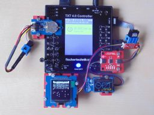
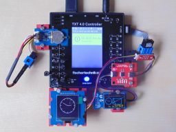

> ROBO Pro Coding I²C Blöcke von fischertechnik GitLab: [ft_Controller_I2C](https://git.fischertechnik-cloud.com/i2c/ft_Controller_I2C)\
> [I²C Module](https://elssner.github.io/ft-Controller-I2C/#tabelle-1) |
[I²C Hardware, Software](https://elssner.github.io/ft-Controller-I2C/#ic) |
[I²C Quellcodedateien, Blöcke](https://elssner.github.io/ft-Controller-I2C/#beschreibung-der-quellcodedateien-alphabetisch-geordnet)\
[I²C Programmierbeispiele im Überblick](../examples)

### oled_text_analoguhr (Analoguhr, Text, Zeichensatz aus EEPROM)

Zwei (gleiche oder verschiedene) OLED Displays können gleichzeitig an den I²C-Bus angeschlossen werden, wenn bei einem die I²C-Adresse von 0x3C in 0x3D geändert wird.
Das große Display hat 128*128 Pixel, das sind 16384 Punkte bzw. 2 Kilobyte, die einzeln an und aus geschaltet werden.\
Linien und Kreise müssen per Software in das Pixel-Muster umgerechnet werden.\
Auch Text Zeichen muss die Software als Pixel an das Display senden. Der Zeichensatz ist im EEPROM gespeichert, es werden einfach pro Zeichen 8 Byte vom EEPROM auf das Display kopiert.\
Über einen I²C-Bus wird die Uhrzeit vom RTC Modul gelesen, in Text-Zeichen aus dem EEPROM umgewandelt und als verschiedene Bilder an zwei Displays gesendet.

Der Block [oled2_demo](#block-oled2_demo) für alle 4 I²C Module ruft die anderen Blöcke als Unterprogramm auf.

Mit dem Block [oled2_systemtime](#block-oled2_systemtime) wird die Uhrzeit vom Controller verwendet. Dafür ist die Erweiterung [advanced](../#advancedpy) erforderlich. Auf das EEPROM und RTC Modul wird verzichtet.

* [Grove - OLED Display 1.12 128*128 Pixel](https://wiki.seeedstudio.com/Grove-OLED-Display-1.12-SH1107_V3.0) → 16 Zeilen * 16 Zeichen
* [Grove - OLED Yellow&Blue Display 0.96 128*64 Pixel](https://wiki.seeedstudio.com/Grove-OLED-Yellow&Blue-Display-0.96-SSD1315_V1.0) → (6 blaue + 2 gelbe Zeilen) * 16 Zeichen
  * [Grove - OLED Display 0.96 128*64 Pixel](https://wiki.seeedstudio.com/Grove-OLED_Display_0.96inch/) → 8 Zeilen * 16 Zeichen
* [SparkFun Qwiic EEPROM - 512Kbit](https://www.sparkfun.com/products/18355) → 64 KByte = 65536 Byte
* [Grove - RTC (Real Time Clock)](https://wiki.seeedstudio.com/Grove_High_Precision_RTC)

#### Block **oled2_demo**
* Quellcodedateien: **[i2cCode](../#i2ccodepy)**, **[oled](../#oledpy)**, **[oled_geometrie](../#oled_geometriepy)**, **[qwiiceeprom](../#qwiiceeprompy)**, **[rtc](../#rtcpy)**, **oled_text_analoguhr**
* I²C Module: 2 OLED Displays 128x128 Pixel und 128x64 Pixel, EEPROM und RTC-Uhr
* Laden von fischertechnik GitLab: [I2C_OLED_Text_Analoguhr](https://git.fischertechnik-cloud.com/i2c/I2C_OLED_Text_Analoguhr)
* Beim RX Controller muss I²C beim Programmstart immer initialisiert werden.

 \
Zum Vergrößern auf das Bild klicken.

* Zeichnet analoge Uhr mit aktueller Zeit auf beide Displays in verschiedener Größe.
* Auf das große Display wird abwechselnd der Zeichnsatz aus dem EEPROM kopiert (2KB).
* Auf dem kleinen Display in den gelben Zeilen wird Datum und Uhrzeit digital angezeigt.
* Im blauen Bereich neben der Uhr werden zufällige Rechtecke und Linien angezeigt.
* Gelb aktualisert jede Sekunde, blau jede Minute.
* Ruft die folgenden Blöcke als Unterprogramm auf.

> Parameter *select_oled* ist False für 128x128 (0x3C) und True für 128x64 (0x3D) Display.

Unterprogramm Block **oled_eeprom_copy** (select_oled)
* Kopiert 2KByte vom EEPROM auf das Display, das entspricht Zeichencodes 0x00..0xFF.
* Löscht und aktualisiert alle 16 Zeilen vom 128x128 Pixel Display.
* Zeile 0..1 leer; 2..7 ASCII Zeichen; 8..15 einzelne Sonderzeichen.
* Zeigt dann alle 14 Sonderzeichen `ß ä ö ü Ä Ö Ü € µ ° Ω ² α π` auch in Zeile 0 an.

Unterprogramm Block **oled_analoguhr_128** (select_oled)
* Zeigt Analoguhr auf dem großen Display an.
* Löscht und aktualisiert alle 16 Zeilen vom 128x128 Pixel Display.
* Der Radius ist zufällig zwischen 48 und 63 Pixel.
* Stunde und Minute kommt aus dem RTC Modul.

Unterprogramm Block **oled_digitaluhr_6_7** (select_oled)
* Zeigt Zeit mit Sekunde, Wochentag und Datum digital (als Ziffern) in den gelben Zeilen an.
* Löscht und aktualisiert nur die 2 gelben Zeilen 6-7 vom 128x64 Pixel Display.
* Die gesamte Zeit (7 Elemente) kommt aus dem RTC Modul, die Zeichen aus dem EEPROM.

Unterprogramm Block **oled_zeichnen_0_5** (select_oled)
* Muss nach  **oled_digitaluhr_6_7** aufgerufen werden.
* Zeichnet Analoguhr links in den blauen Bereich des 128x64 Displays.
* Zeichnet rechts daneben zufällige Rechtecke und Linien x=48..127; y=0..47.
* Löscht und aktualisiert nur die 6 blauen Zeilen 0-5 vom 128x64 Pixel Display.

#### Block **oled2_systemtime**
* Quellcodedateien: **[i2cCode](../#i2ccodepy)**, **[advanced](../#advancedpy)**, **[oled](../#oledpy)**, **[oled_geometrie](../#oled_geometriepy)**, **oled_text_analoguhr**
* I²C Module: 2 OLED Displays 128x128 Pixel und 128x64 Pixel
* Laden von fischertechnik GitLab: [I2C_OLED_Text_Analoguhr](https://git.fischertechnik-cloud.com/i2c/I2C_OLED_Text_Analoguhr)

* Zeichnet analoge Uhr mit aktueller Zeit auf beide Displays in verschiedener Größe.
* Auf dem kleinen Display wechseln Rechtecke blau / gelb im Sekundentakt.
* TXT 4.0 Controller: Systemzeit vom Controller, muss synchronisiert sein und richtige Zeitzone.
* RX Controller: Zeitstempel seit dem Einschalten umgerechnet in Stunden, Minuten.
* Text Zeichen werden nicht angezeigt, nur Linien und Kreise.
