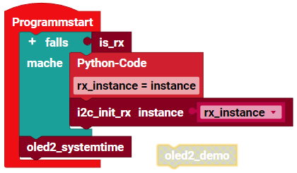

> ROBO Pro Coding I²C Blöcke von fischertechnik GitLab: [ft_Controller_I2C](https://git.fischertechnik-cloud.com/i2c/ft_Controller_I2C)\
> [I²C Module](https://elssner.github.io/ft-Controller-I2C/#tabelle-1) |
[I²C Hardware, Software](https://elssner.github.io/ft-Controller-I2C/#ic) |
[I²C Quellcodedateien, Blöcke](https://elssner.github.io/ft-Controller-I2C/#beschreibung-der-quellcodedateien-alphabetisch-geordnet)\
[I²C Programmierbeispiele im Überblick](../examples)

### oled_text_analoguhr (Analoguhr, Text, Zeichensatz aus EEPROM)

Zwei (gleiche oder verschiedene) OLED Displays können gleichzeitig an den I²C-Bus angeschlossen werden, wenn bei einem die I²C-Adresse von 0x3C in 0x3D geändert wird.
Das große Display hat 128*128 Pixel, das sind 16384 Punkte bzw. 2 Kilobyte, die einzeln an und aus geschaltet werden.\
Linien und Kreise müssen per Software in das Pixel-Muster umgerechnet werden.\
Auch Text Zeichen muss die Software als Pixel an das Display senden. Der Zeichensatz ist im EEPROM gespeichert, es werden einfach pro Zeichen 8 Byte vom EEPROM auf das Display kopiert.\
Über einen I²C-Bus wird die Uhrzeit vom RTC Modul gelesen, in Text-Zeichen aus dem EEPROM umgewandelt und als verschiedene Bilder an zwei Displays gesendet.

Der Block [**oled2_demo**](#block-oled2_demo) benötigt alle 4 I²C Module.

Mit dem Block [**oled2_systemtime**](#block-oled2_systemtime) wird die Uhrzeit vom Controller verwendet. Dafür ist die Erweiterung [advanced](../#advancedpy) erforderlich. Auf das EEPROM und RTC Modul wird verzichtet.

* [Grove - OLED Display 1.12 128*128 Pixel](https://wiki.seeedstudio.com/Grove-OLED-Display-1.12-SH1107_V3.0) → 16 Zeilen * 16 Zeichen
* [Grove - OLED Yellow&Blue Display 0.96 128*64 Pixel](https://wiki.seeedstudio.com/Grove-OLED-Yellow&Blue-Display-0.96-SSD1315_V1.0) → (6 blaue + 2 gelbe Zeilen) * 16 Zeichen
  * [Grove - OLED Display 0.96 128*64 Pixel](https://wiki.seeedstudio.com/Grove-OLED_Display_0.96inch/) → 8 Zeilen * 16 Zeichen
* [SparkFun Qwiic EEPROM - 512Kbit](https://www.sparkfun.com/products/18355) → 64 KByte = 65536 Byte
* [Grove - RTC (Real Time Clock)](https://wiki.seeedstudio.com/Grove_High_Precision_RTC)

#### Block **oled2_demo**
* Quellcodedateien: **[i2cCode](../#i2ccodepy)**, **[oled](../#oledpy)**, **[oled_geometrie](../#oled_geometriepy)**, **[qwiiceeprom](../#qwiiceeprompy)**, **[rtc](../#rtcpy)**, **oled_text_analoguhr**
* I²C Module: 2 OLED Displays 128x128 Pixel und 128x64 Pixel, EEPROM und RTC-Uhr
* Laden von fischertechnik GitLab: [I2C_OLED_Text_Analoguhr](https://git.fischertechnik-cloud.com/i2c/I2C_OLED_Text_Analoguhr)

#### Block **oled2_systemtime**
* Quellcodedateien: **[i2cCode](../#i2ccodepy)**, **[advanced](../#advancedpy)**, **[oled](../#oledpy)**, **[oled_geometrie](../#oled_geometriepy)**, **oled_text_analoguhr**
* I²C Module: 2 OLED Displays 128x128 Pixel und 128x64 Pixel
* Laden von fischertechnik GitLab: [I2C_OLED_Text_Analoguhr](https://git.fischertechnik-cloud.com/i2c/I2C_OLED_Text_Analoguhr)

* Zeichnet analoge Uhr auf beide Displays in verschiedener Größe.
* Auf dem kleinen Display wechseln Rechtecke blau / gelb im Sekundentakt.
* TXT 4.0 Controller: Systemzeit vom Controller, muss synchronisiert sein und richtige Zeitzone.
* RX Controller: Zeitstempel seit dem Einschalten umgerechnet in Stunden, Minuten.
* Text Zeichen werden nicht angezeigt, nur Linien und Kreise.
