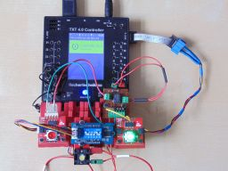
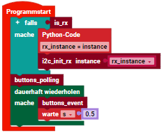
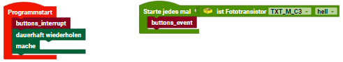
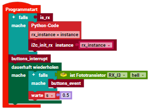

> ROBO Pro Coding I²C Blöcke von fischertechnik GitLab: [ft_Controller_I2C](https://git.fischertechnik-cloud.com/i2c/ft_Controller_I2C)\
> [I²C Module](https://elssner.github.io/ft-Controller-I2C/#tabelle-1) |
[I²C Hardware, Software](https://elssner.github.io/ft-Controller-I2C/#ic) |
[I²C Quellcodedateien, Blöcke](https://elssner.github.io/ft-Controller-I2C/#beschreibung-der-quellcodedateien-alphabetisch-geordnet)\
[I²C Programmierbeispiele im Überblick](../examples)

### qwiicbutton_int (Beispiel)

Das Beispiel demonstriert den Hardware Interrupt von zwei [SparkFun Qwiic Button](https://www.sparkfun.com/products/16842) Modulen. Die im Button eingebaute LED rot bzw. grün wird beim Klicken an und aus geschaltet. 
Der [DIP Schalter](https://wiki.seeedstudio.com/Grove-6-Position_DIP_Switch) steuert bei der grünen LED die Helligkeit, bei der roten die Blinkfrequenz. Mit der grünen LED kann auch noch ein [Relais](https://www.sparkfun.com/products/15093) geschaltet werden.

* Quellcodedateien: **[i2cCode](../#i2ccodepy)**, **[qwiicbutton](../#qwiicbuttonpy)**, **[dipswitch](../#dipswitchpy)**, **[qwiicrelay](../#qwiicrelaypy)**
* [I²C Module mit Hardware Interrupt](../#ic-module-mit-hardware-interrupt)
* Laden von fischertechnik GitLab: [I2C_Buttons_DipSwitch_Relay](https://git.fischertechnik-cloud.com/i2c/I2C_Buttons_DipSwitch_Relay)

[ für großes Bild klicken](DSC00417.JPG)

I²C Module, die eine Eingabe machen wie Buttons, müssen normalerweise in einer dauerhaft Schleife ständig über den I²C-Bus abgefragt werden, ob sich der Zustand geändert hat.

Solche I²C Module haben oft einen zusätzlichen (Löt-) Interrupt-Pin /INT, der außerhalb vom I²C-Bus extra verdrahtet werden kann.

Die I²C Module haben 3,3V Logik, die fischertechnik Controller aber 9V Logik. Um die /INT Leitungen an einen Controller Input anzuschließen, wird ein Optokoppler empfohlen.
Der Optokoppler hat am Ausgang einen Fototransistor. Die Controller können am Input einen Fototransistor digital hell/dunkel abfragen. → [I²C Module mit Hardware Interrupt](../#ic-module-mit-hardware-interrupt)

Somit kann der Fototransistor an einem beliebeigen Input I1 bis I8 (beim TXT 4.0 Controller auch C1 bis C4) angeschlossen werden. 
Mit dem Block `ist Fototransistor hell` wird erkannt, ob ein Hardware /INT von einem I²C Modul aktiv ist, weil ein Button geklickt wurde. 
Nur dann wird der I²C-Bus abgefragt.

Der TXT 4.0 Controller unterstützt Ereignis Blöcke. Beim Programmstart wird nur der Interrupt bei den Buttons aktiviert. 
Über die Hardware und den Optokoppler wird nur dann Code ausgeführt, wenn ein Button geklickt wurde und das Ereignis `ist Fototransistor hell` auslöst.

Weil der RX Controller keine Ereignisse untersützt, kann der Fototransistor in einer dauerhaft Schleife abgefragt werden. 
Auch damit kann der Verkehr aus dem I²C-Bus reduziert werden.

Block **buttons_polling**
* Beispiel ohne Interrupt kann beim Programmstart aufgerufen werden.
* Buttons werden in dauerhaft Schleife über den I²C-Bus abgefragt (polling).
* Keine Verdrahtung der /INT Pins erforderlich.

Block **buttons_interrupt**
* Beispiel mit Interrupt kann beim Programmstart aufgerufen werden.
* Konfiguriert Button-Interrupt *when_clicked*.
* Buttons werden nur bei aktiver /INT Leitung abgefragt, im Block **buttons_event**.
* Verdrahtung der /INT Pins über Optokoppler erforderlich.

Block **buttons_event**

* Ereignis-Blöcke werden nur vom TXT 4.0 Controller unterstützt.
* Block **buttons_event** muss in das Fototransistor Ereignis eingefügt werden.

* Beim RX Controller kann der Block in einer dauerhaft Schleife abgefragt werden.

* Funktion sucht über den I²C-Bus den geklickten Button und setzt dessen /INT zurück.
* Die LED wird bei jedem Klick an und aus geschaltet.
* Der DIP Schalter steuert bei der grünen LED die Helligkeit, bei der roten die Blinkfrequenz.

