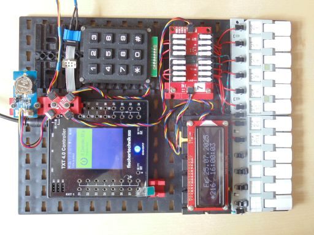
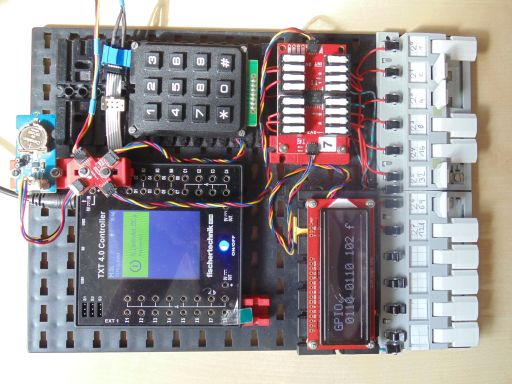
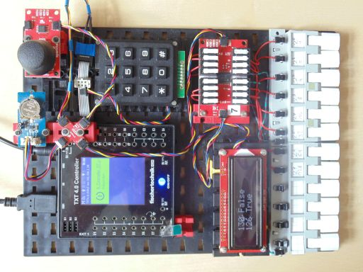
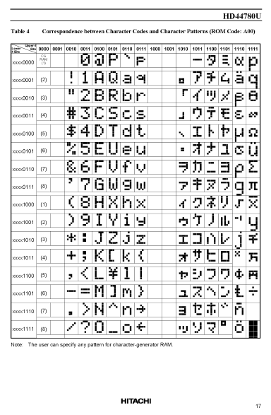

> ROBO Pro Coding I²C Blöcke von fischertechnik GitLab: [ft_Controller_I2C](https://git.fischertechnik-cloud.com/i2c/ft_Controller_I2C)\
> [I²C Module](https://elssner.github.io/ft-Controller-I2C/#tabelle-1) |
[I²C Hardware, Software](https://elssner.github.io/ft-Controller-I2C/#ic) |
[I²C Quellcodedateien, Blöcke](https://elssner.github.io/ft-Controller-I2C/#beschreibung-der-quellcodedateien-alphabetisch-geordnet)\
[I²C Programmierbeispiele im Überblick](../examples)

### qwiiclcd_keypad_rtc (Qwiic LCD: RTC Uhr stellen, GPIO ASCII Eingabe, Joystick)

Beispiele mit einem Qwiic LCD Display 16x2 [RGB Backlight](https://www.sparkfun.com/products/16396) oder [RGB Text](https://www.sparkfun.com/products/16397). Das größere [20x4](https://www.sparkfun.com/products/16398) ist auch verwendbar.
* Laden von fischertechnik GitLab: [I2C_LCD_RTC_GPIO](https://git.fischertechnik-cloud.com/i2c/I2C_LCD_RTC_GPIO)

Block **qlcd_uhr_stellen**
* Quellcodedateien: **[i2cCode](../#i2ccodepy)**, **[qwiickeypad](../#qwiickeypadpy)**, **[qwiiclcd](../#qwiiclcdpy)**, **[rtc](../#rtcpy)**

\
Zum Vergrößern auf das Bild klicken.

* Zeigt Datum und Uhrzeit von RTC Modul auf dem LCD Display an.
* Aktualisiert jede Sekunde.
* Mit dem Keypad kann Uhr und Datum gestellt werden.
* Um ein Register zu ändern, müssen 5 Tasten gedrückt werden:\
1\. Zeichen: `*`\
2\. Zeichen: Register `0`..`6`\
    `0`=Seconds, [1]=Minutes, [2]=Hours, [3]=Days, [4]=Weekdays, [5]=Months, [6]=Years\
    Weekdays 0..6: [0]=Sonntag\
3\. und 4. Zeichen: 2 Ziffern dezimal Zahl 00..59\
5\. Zeichen: `#` speichern

* a

\
Zum Vergrößern auf das Bild klicken.

\
Zum Vergrößern auf das Bild klicken.

