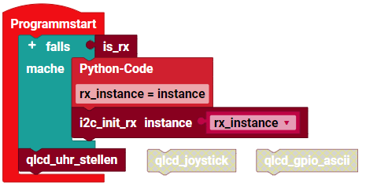

> ROBO Pro Coding I²C Blöcke von fischertechnik GitLab: [ft_Controller_I2C](https://git.fischertechnik-cloud.com/i2c/ft_Controller_I2C)\
> [I²C Module](https://elssner.github.io/ft-Controller-I2C/#tabelle-1) |
[I²C Hardware, Software](https://elssner.github.io/ft-Controller-I2C/#ic) |
[I²C Quellcodedateien, Blöcke](https://elssner.github.io/ft-Controller-I2C/#beschreibung-der-quellcodedateien-alphabetisch-geordnet)\
[I²C Programmierbeispiele im Überblick](../examples)

### qwiiclcd_keypad_rtc (RTC Uhr stellen, GPIO→ASCII, Joystick)

* [SparkFun Qwiic LCD Display 16x2](https://www.sparkfun.com/products/16397)
* [SparkFun Qwiic GPIO](https://www.sparkfun.com/products/17047)
* [SparkFun Qwiic Joystick](https://www.sparkfun.com/products/15168)
* [SparkFun Qwiic Keypad 12 Tasten](https://www.sparkfun.com/products/15290)
* [Grove - RTC (Real Time Clock)](https://wiki.seeedstudio.com/Grove_High_Precision_RTC)
* [Tillig Modellbahn Tastenpult](https://www.tillig.com/Produkte/produktinfo-08211.html)

Uhr stellen mit Keypad, Joystick auslesen und Binär Schreibmaschine, alles mit LCD Display.

Block **qlcd_uhr_stellen**
* Quellcodedateien: **[i2cCode](../#i2ccodepy)**, **[qwiickeypad](../#qwiickeypadpy)**, **[qwiiclcd](../#qwiiclcdpy)**, **[rtc](../#rtcpy)**, **qwiiclcd_keypad_rtc**
* I²C Module: Qwiic LCD Display, I²C Keypad 12 Tasten, RTC-Uhr
* Laden von fischertechnik GitLab: [I2C_LCD_RTC_GPIO_Keypad_Joystick](https://git.fischertechnik-cloud.com/i2c/I2C_LCD_RTC_GPIO_Keypad_Joystick)

\
Zum Vergrößern auf das Bild klicken.

* Zeigt Datum und Uhrzeit von RTC Modul auf dem LCD Display an.
* Aktualisiert jede Sekunde.
* Mit dem Keypad kann Uhr und Datum gestellt werden (7 Register einzeln).
* Um ein Register zu ändern, müssen 5 Tasten gedrückt werden:\
1\. Zeichen: `*` startet neue Eingabe\
2\. Zeichen: Register `0`..`6`\
3\. und 4. Zeichen: 2 Ziffern dezimal Zahl `00`..`59`, Jahr 2-stellig\
5\. Zeichen: `#` speichern
* Register: `0` Seconds, `1` Minutes, `2` Hours, `3` Days, `4` Weekdays, `5` Months, `6` Years
* Weekdays: `00` So, `01` Mo, `02` Di, `03` Mi, `04` Do, `05` Fr, `06` Sa
* Die bereits eingegebenen Zeichen werden im Display 2. Zeile angezeigt.
* `*216#` stellt Stunde auf 16; `*402#` Dienstag; `*000#` Sekunde 0; `*625#` Jahr 2025

Block **qlcd_joystick**
* Quellcodedateien: **[i2cCode](../#i2ccodepy)**, **[qwiicjoystick](../#qwiicjoystickpy)**, **[qwiiclcd](../#qwiiclcdpy)**, **qwiiclcd_keypad_rtc**
* I²C Module: Qwiic LCD Display, I²C Joystick
* Laden von fischertechnik GitLab: [I2C_LCD_RTC_GPIO_Keypad_Joystick](https://git.fischertechnik-cloud.com/i2c/I2C_LCD_RTC_GPIO_Keypad_Joystick)

\
Zum Vergrößern auf das Bild klicken.

* Zeigt X und Y Wert vom Joystick auf dem LCD Display an.
* Außerdem ob der Button vom Joystick gedrückt ist oder war.
* Der 'onoff' Wert wechselt bei jedem Drücken False/True.
* In Ruhestellung soll X und Y den Wert 128 haben.
* Die Werte weichen produktionsbedingt leicht davon ab.
* Joystick links bzw. unten: 0; rechts bzw. oben: 255
* Werte können direkt an den [SparkFun Qwiic Motor Driver](https://www.sparkfun.com/products/15451) übergeben werden.

Block **qlcd_gpio_ascii**
* Quellcodedateien: **[i2cCode](../#i2ccodepy)**, **[qwiicgpio](../#qwiicgpiopy)**, **[qwiiclcd](../#qwiiclcdpy)**, **qwiiclcd_keypad_rtc**
* I²C Module: Qwiic LCD Display, I²C GPIO 8 Bit Input von Modellbahn Tastenpult
* Laden von fischertechnik GitLab: [I2C_LCD_RTC_GPIO_Keypad_Joystick](https://git.fischertechnik-cloud.com/i2c/I2C_LCD_RTC_GPIO_Keypad_Joystick)

\
Zum Vergrößern auf das Bild klicken.

* Das ist eine Binärschreibmaschine.
* Mit 8 [Modelleisenbahntasten](https://www.tillig.com/Produkte/produktinfo-08211.html) (von rechts) werden die 8 GPIO Eingänge geschaltet.
* Die 8 Bit werden in der 2. Zeile binär, dezimal und als ASCII Zeichen angezeigt.
* Für den Zeichencode werden 7 Bit verwendet.
* Das 8. Bit (die gedrückte Taste 2^7) überträgt das Zeichen in Zeile 1.
* So kann ein Text bis zur Länge 16 ASCII Zeichen geschrieben werden.
* Taste 8 und Code 0 `1000 0000` löscht das Display.
* Für Code `0010 0000` (32) bis `0111 1111` (127) gelten die linken 6 Spalten in der Tabelle.

\
Zur pdf-Datei auf die Tabelle klicken.

* Für Code `0000 0001` (1) bis `0001 1111` (31) gelten die rechten 2 Spalten in der Tabelle.
* Zum Code wird 0xE0 addiert, um die Zeichen 0xE1..0xFF des Displays zu nutzen.
* Allerdings funktionieren nicht alle 32 Zeichen wie erwartet.
* `0000 0001` ä, `0000 1111` ö, `0001 0101` ü, `0000 0010` ß, `0000 0011` €

\
Beim RX Controller muss I²C beim Programmstart initialisiert werden.
