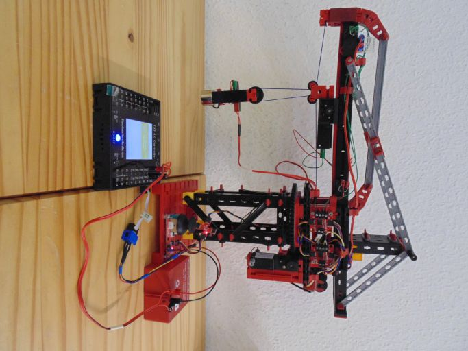
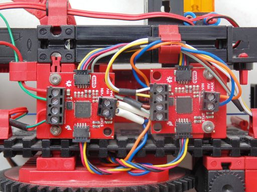
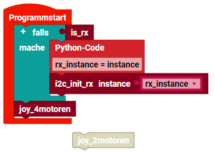

> ROBO Pro Coding I²C Blöcke von fischertechnik GitLab: [ft_Controller_I2C](https://git.fischertechnik-cloud.com/i2c/ft_Controller_I2C)\
> [I²C Module](https://elssner.github.io/ft-Controller-I2C/#tabelle-1) |
[I²C Hardware, Software](https://elssner.github.io/ft-Controller-I2C/#ic) |
[I²C Quellcodedateien, Blöcke](https://elssner.github.io/ft-Controller-I2C/#beschreibung-der-quellcodedateien-alphabetisch-geordnet)\
[I²C Programmierbeispiele im Überblick](../examples)

### qwiicmotor_joystick (I²C Motor Driver mit I²C Joystick steuern)

*  [SparkFun Qwiic Motor Driver](https://www.sparkfun.com/products/15451)
*  [SparkFun Qwiic Joystick](https://www.sparkfun.com/products/15168) 

Mit zwei I²C Modulen 'SparkFun Qwiic Motor Driver' lassen sich vier (zusätzliche) Motoren steuern. Oder wie beim Kran drei Motoren und ein Elektromagnet.
Nichts ist einfacher, als diese Motoren mit dem I²C Joystick zu steuern. Mit Drücken auf den Joystick wird der Motor Chip gewechselt.
Mit Bewegung in X oder Y Richtung wird jeweils einer der zwei Motoren an einem Motor Modul gesteuert, oder beide Motoren gleichzeitig.

Block **joy_2motoren**

* Quellcodedateien: **[i2cCode](../#i2ccodepy)**, **[qwiicjoystick](../#qwiicjoystickpy)**, **[qwiicmotor](../#qwiicmotorpy)**
* I²C Module: I²C Motor Driver, I²C Joystick
* Laden von fischertechnik GitLab: [I2C_Motoren_Joystick](https://git.fischertechnik-cloud.com/i2c/I2C_Motoren_Joystick)

\
Zum Vergrößern auf das Bild klicken.

* Verwendet nur ein I²C Motor Modul (für 2 Motoren) und den Joystick.
* Drücken auf Joystick schaltet Motor Power an und aus.
* Mit dem Joystick werden beide Motoren in dauerhaft Schleife gesteuert.

Block **joy_4motoren**

* Quellcodedateien: **[i2cCode](../#i2ccodepy)**, **[qwiicjoystick](../#qwiicjoystickpy)**, **[qwiicmotor](../#qwiicmotorpy)**
* I²C Module: 2 Stück I²C Motor Driver, I²C Joystick
* Laden von fischertechnik GitLab: [I2C_Motoren_Joystick](https://git.fischertechnik-cloud.com/i2c/I2C_Motoren_Joystick)

\
Zum Vergrößern auf das Bild klicken.

* Verwendet zwei I²C Motor Module (für 4 Motoren) und den Joystick.
* Beim zweiten Modul wurde die I²C-Adresse geändert (Lötbrücke).
* (Es sind 10 I²C-Adressen möglich, also 20 Motoren an einem I²C-Bus...)
* Drücken auf Joystick schaltet I²C-Adresse und Motor Power zwischen den Motor-Modulen um.
* Mit dem Joystick werden die aktiven Motoren in dauerhaft Schleife gesteuert.

* Beim RX Controller muss I²C beim Programmstart immer initialisiert werden.
