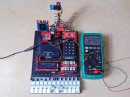
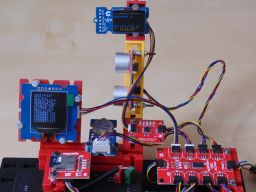
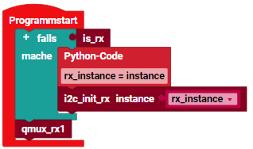

> ROBO Pro Coding I²C Blöcke von fischertechnik GitLab: [ft_Controller_I2C](https://git.fischertechnik-cloud.com/i2c/ft_Controller_I2C)\
> [I²C Module](https://elssner.github.io/ft-Controller-I2C/#tabelle-1) |
[I²C Hardware, Software](https://elssner.github.io/ft-Controller-I2C/#ic) |
[I²C Quellcodedateien, Blöcke](https://elssner.github.io/ft-Controller-I2C/#beschreibung-der-quellcodedateien-alphabetisch-geordnet)\
[I²C Programmierbeispiele im Überblick](../examples)

### qwiicmux_rx (RX Controller mit I²C Multiplexer, 10 I²C Module)

Im Beispiel werden 10 I²C Module vom RX Controller gesteuert: 

* [SparkFun Qwiic I²C Multiplexer](https://www.sparkfun.com/products/16784)
* [SparkFun Qwiic LCD Display 16x2 Zeichen](https://www.sparkfun.com/products/16397)
* [Grove OLED Display 128x128 Pixel](https://wiki.seeedstudio.com/Grove-OLED-Display-1.12-SH1107_V3.0)
* [Grove OLED Display 128x64 Pixel](https://wiki.seeedstudio.com/Grove-OLED-Yellow&Blue-Display-0.96-SSD1315_V1.0)
* [SparkFun Qwiic EEPROM](https://www.sparkfun.com/products/18355)
* [Grove - High Precision RTC (Real Time Clock)](https://wiki.seeedstudio.com/Grove_High_Precision_RTC)
* [SparkFun Qwiic OpenLog (Speicherkarte)](https://www.sparkfun.com/products/15164)
* [SparkFun Qwiic Keypad - 12 Button](https://www.sparkfun.com/products/15290)
* [SparkFun Qwiic GPIO](https://www.sparkfun.com/products/17047)
* [SparkFun Qwiic Ultrasonic Distance Sensor - HC-SR04](https://www.sparkfun.com/products/17777)

Der I²C Multiplexer kann 8 I²C-Busse einzeln oder gemeinsam an und aus schalten. Gebraucht wird das unter anderem, um mehrere I²C Module mit gleicher I²C-Adresse gleichzeitig zu benutzen.\
Der Multiplexer ermöglicht aber auch dem RX Controller mehr als 2 bis 3 I²C Module anzusteuern. Der Grund ist nicht bekannt, aber der RX Controller scheitert an zu vielen I²C-Adressen, nicht an zu vielen I²C Modulen.

Wenn mit dem Multiplexer immer nur ein Kanal mit 1 oder 2 I²C Modulen (= I²C-Adressen) zugeschaltet wird, kann der RX Controller 10 und mehr Module ansteuern. An der 3,3V Stromversorgung scheitert das nicht.
<!--
Im Beispiel werden 10 I²C Module vom RX Controller gesteuert: Der [Multiplexer](https://www.sparkfun.com/products/16784) selbst, [LCD-Display](https://www.sparkfun.com/products/16397), 
[OLED 128x128 Display](https://wiki.seeedstudio.com/Grove-OLED-Display-1.12-SH1107_V3.0), [OLED 128x64 Display](https://wiki.seeedstudio.com/Grove-OLED-Yellow&Blue-Display-0.96-SSD1315_V1.0), 
[EEPROM](https://www.sparkfun.com/products/18355), [RTC](https://wiki.seeedstudio.com/Grove_High_Precision_RTC), [Speicherkarte](https://www.sparkfun.com/products/15164), 
[Keypad](https://www.sparkfun.com/products/15290), [GPIO](https://www.sparkfun.com/products/17047), [Ultraschallsensor](https://www.sparkfun.com/products/17777).
-->
Die Displays zeigen Datum und Uhrzeit an. Das große OLED Display zeigt abwechselnd eine Analoguhr und 16 Dateinamen von der Speicherkarte an. Aus dem EEPROM kommen die Pixel, damit OLED Zeichen anzeigen kann.
GPIO liest 8 Tasten von der Modelleisenbahn Tastatur und zeigt diese binär und als ASCII Zeichen an. Mit dem Keypad kann die Uhr gestellt werden. Der Abstand vom Ultraschallsensor wird ebenfalls angezeigt.

Block **qmux_rx1**

* Quellcodedateien: **[i2cCode](../#i2ccodepy)**, **[advanced](../#advancedpy)**, **[oled](../#oledpy)**, **[oled_geometrie](../#oled_geometriepy)**, **[qwiiceeprom](../#qwiiceeprompy)**, **[qwiicgpio](../#qwiicgpiopy)**,\
**[qwiickeypad](../#qwiickeypadpy)**, **[qwiiclcd](../#qwiiclcdpy)**, **[qwiicmux](../#qwiicmuxpy)**, **[qwiicopenlog](../#qwiicopenlogpy)**, **[rtc](../#rtcpy)**, **[s_qwiicultrasonic](../#s_qwiicultrasonicpy)**
* I²C Module: 10
* Laden von fischertechnik GitLab: [I2C_Multiplexer](https://git.fischertechnik-cloud.com/i2c/I2C_Multiplexer)

 \
Zum Vergrößern auf das Bild klicken.

* Beispiel **qmux_rx1** kann beim Programmstart aufgerufen werden.
* Projekt kann für TXT 4.0 Controller konvertiert werden.
* **i2c_scan** kann zur Kontrolle aller Kanäle angezeigt (oder weg gelassen) werden.
* **list_hex** befindet sich in **[advanced](../#advancedpy)**, **i2c_scan** in **[i2cCode](../#i2ccodepy)**.
* Programm läuft sonst ohne Verbindung zur App ROBO Pro Coding.

* Beim RX Controller muss I²C beim Programmstart immer initialisiert werden.
