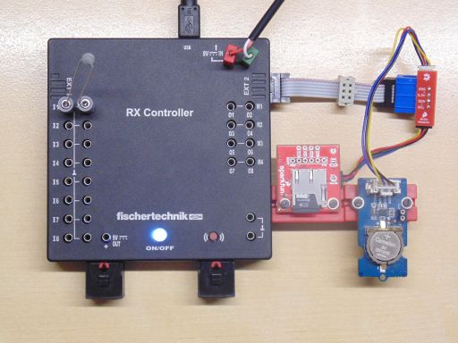
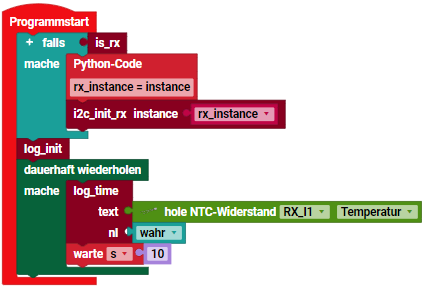

> ROBO Pro Coding I²C Blöcke von fischertechnik GitLab: [ft_Controller_I2C](https://git.fischertechnik-cloud.com/i2c/ft_Controller_I2C)\
> [I²C Module](https://elssner.github.io/ft-Controller-I2C/#tabelle-1) |
[I²C Hardware, Software](https://elssner.github.io/ft-Controller-I2C/#ic) |
[I²C Quellcodedateien, Blöcke](https://elssner.github.io/ft-Controller-I2C/#beschreibung-der-quellcodedateien-alphabetisch-geordnet)\
[I²C Programmierbeispiele im Überblick](../examples)

### qwiicopenlog_rtc (Dateien lesen und protokollieren auf Speicherkarte)

* [SparkFun Qwiic OpenLog](https://www.sparkfun.com/products/15164)
* [Grove - RTC (Real Time Clock)](https://wiki.seeedstudio.com/Grove_High_Precision_RTC)
* [NTC-Widerstand 1,5 kΩ](https://www.fischertechnik.de/de-de/produkte/einzelteile/elektronik/36437-ntc-widerstand-1-5-k-silber)

In das I²C Modul 'SparkFun Qwiic OpenLog' wird eine microSD card 64MB .. 32GB, FAT16 oder FAT32 gesteckt.
Im Beispiel [log_konsole](#log_konsole) wird die Anwendung der Blöcke in [qwiicopenlog](../#qwiicopenlogpy) mit Ausgabe in die Konsole demonstriert. Beispiel [log_copy](#log_copy) kopiert eine Datei.\
Das Beispiel [log_time](#log_time) zeigt den eigentlichen Zweck des Moduls, in eine Datei zu protokollieren.

Vor allem für den RX Controller ist das interessant, weil der weder Speicherkarte noch Uhr integriert hat. Allerdings wird beim Lesen und Kopieren von Dateien viel Speicher gebraucht, der beim RX Controller nicht immer ausreicht.
Manchmal wird in der Konsole ein Memory Allocation Error angezeigt. Oft hängt er einfach und muss aus und ein geschaltet werden. Für kleine Dateien und zum protokollieren in eine Datei funktioniert das aber gut.

Block **log_konsole** (filename1)
* Quellcodedateien: **[i2cCode](../#i2ccodepy)**, **[advanced](../#advancedpy)**, **[qwiicopenlog](../#qwiicopenlogpy)**, **qwiicopenlog_rtc**
* I²C Module:  Qwiic OpenLog mit Speicherkarte
* Laden von fischertechnik GitLab: [I2C_Speicherkarte_Uhr](https://git.fischertechnik-cloud.com/i2c/I2C_Speicherkarte_Uhr)

Ausgabe in Konsole:

> init_i2c_factory\
SD Card Status: 0b11101\
['ASCII.TXT', 'REMOVE08.TXT', 'UMLAUTE.TXT', 'UTF8BOM.TXT', 'ASCII2.TXT', 'LOG00002.TXT', 'LOG00003.TXT', 'LOG00004.TXT']\
ASCII.TXT Länge Datei: 108\
REMOVE08.TXT Länge Datei: 99\
UMLAUTE.TXT Länge Datei: 31\
UTF8BOM.TXT Länge Datei: 19\
ASCII2.TXT Länge Datei: 108\
LOG00002.TXT Länge Datei: 0\
LOG00003.TXT Länge Datei: 0\
LOG00004.TXT Länge Datei: 0\
\
ASCII.TXT Länge Datei: 108\
ASCII.TXT Länge Bytes: 108\
ASCII.TXT Länge Text decode_latin: 108\
 !"#$%&'()*+,-./\
0123456789:;<=>?\
@ABCDEFGHIJKLMNO\
PQRSTUVWXYZ[\\]^_\
`abcdefghijklmno\
pqrstuvwxyz{|}~

* Parameter *filename1* kann Platzhalter wie z.B. \*.\* oder \*.TXT enthalten.
* Zeigt 8 Dateinamen mit Datei-Größe in Bytes in der Konsole an.
* Liest dann von der 1. Datei in der Liste maximal 200 Byte.
* Konvertiert die Bytes und zeigt den Text in der Konsole an.
* Die Länge 200 kann im Code geändert werden, ist beim RX aber begrenzt.
* Beim TXT 4.0 Controller sind > 10000 Bytes kein Problem.

> Die folgenden Blöcke können auch ohne Verbindung zur App ROBO Pro Coding benutzt werden. Dann wird nur nichts in der Konsole angezeigt.

Block **log_copy** (filename1, filename2, size)
* Kopiert (dupliziert) eine Datei im selben Ordner (Speicherkarte root).
* *filename1* ist die Quelldatei, die vorhanden sein muss.
* *filename2* Name der Zieldatei, wird angehängt oder neu angelegt.
* *size* maximale Bytes, die kopiert werden.
* Die gesamte Datei wird in ein Bytearray gelesen, dann wieder geschrieben.
* Die neue Größe der Zieldatei wird in der Konsole angezeigt.
* Beim TXT 4.0 Controller wurde mit > 60KBytes erfolgreich getestet.
* Beim RX Controller < 1 KByte.
* In der Datei enthaltenes 0xFF wird als EOF (Dateiende) behandelt.
* Bei wiederholtem Aufruf wird an die Zieldatei angehängt.

Block **log_time** (text, new_line)
* Quellcodedateien: **[i2cCode](../#i2ccodepy)**, **[advanced](../#advancedpy)**, **[qwiicopenlog](../#qwiicopenlogpy)**, **[rtc](../#rtcpy)**, **qwiicopenlog_rtc**
* I²C Module: Qwiic OpenLog mit Speicherkarte, RTC-Uhr
* sonstige Hardware: NTC Widerstand fischertechnik 36437 oder 205652
* Laden von fischertechnik GitLab: [I2C_Speicherkarte_Uhr](https://git.fischertechnik-cloud.com/i2c/I2C_Speicherkarte_Uhr)

\
Zum Vergrößern auf das Bild klicken.

* Protokolliert die Temperatur vom NTC Widerstand in eine Datei.
* Parameter *text* wird mit str() konvertiert.
* *text* wird an die Datei angehängt (oder neu angelegt).
* Ist *new_line*=True, wird noch CR (=13) und LF (=10) angehängt.
* Dateiname und neue Größe der Logdatei wird in der Konsole angezeigt.
* Dateiname wird aus Datum und Zeit gebildet: `yyMMddHH`.LOG.
* Datum und Zeit wird aus angeschlossenem [RTC-Modul](../#rtcpy) gelesen.
* So beginnt jede Stunde eine neue Datei mit sortierbarem Dateiname.

\
Beim RX Controller muss I²C beim Programmstart initialisiert werden.
