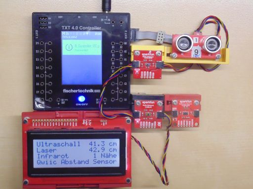
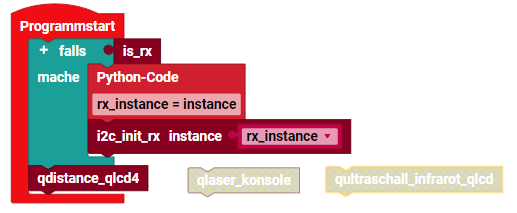

> ROBO Pro Coding I²C Blöcke von fischertechnik GitLab: [ft_Controller_I2C](https://git.fischertechnik-cloud.com/i2c/ft_Controller_I2C)\
> [I²C Module](https://elssner.github.io/ft-Controller-I2C/#tabelle-1) |
[I²C Hardware, Software](https://elssner.github.io/ft-Controller-I2C/#ic) |
[I²C Quellcodedateien, Blöcke](https://elssner.github.io/ft-Controller-I2C/#beschreibung-der-quellcodedateien-alphabetisch-geordnet)\
[I²C Programmierbeispiele im Überblick](../examples)

### s_qwiic_distance (4 Abstands- und Nähe Sensoren, Qwiic LCD 20x4)

Angezeigt werden die Messwerte auf dem größten LCD Dispaly mit 4 Zeilen * 20 Zeichen:
* [SparkFun Qwiic 20x4 SerLCD - RGB Backlight](https://www.sparkfun.com/products/16398)

Es gibt verschiedene Technologien, um 'Distance' zu messen. Hier sind 4 verschiedene I²C Sensoren im Einsatz: 
* [SparkFun Qwiic Ultrasonic Distance Sensor - HC-SR04](https://www.sparkfun.com/products/17777)
* [SparkFun Qwiic Proximity Sensor - 20cm, VCNL4040](https://www.sparkfun.com/products/15177)
* [SparkFun Qwiic Distance Sensor - 4 Meter, VL53L1X](https://www.sparkfun.com/products/14722)
* [SparkFun Qwiic Distance Sensor - 1.3 Meter, VL53L4CD](https://www.sparkfun.com/products/18993).

Die beiden letzten sind Laser Sensoren mit unterschiedlicher Entfernung, aber gleicher Software und gleicher I²C-Adresse. Beide können nicht gleichzeitig benutzt werden, dafür aber einfach umgesteckt.

Der Proximity Sensor erkennt mit Infrarot, ob ein Objekt näher als 20cm ist. Ein Beispiel ist der Seifenspender.

Am bekanntesten ist der Ultraschallsensor, allerdings nicht mit I²C Anschluss. Dieser hat einen eigenen Prozessor und der Abstand in Millimeter muss nur noch über den I²C-Bus ausgelesen werden.
Außerdem erkennt dieses Modul ein Hindernis auch schräg, oben und unten. Damit ist dieser Ultraschallsensor hervorragend geeignet, um Roboter selbst fahren zu lassen, ohne dass sie (schräg) anfahren.

Um die 3 gleichzeitig gemessenen Abstände anzuzeigen, wird das große [SparkFun Qwiic 20x4 SerLCD - RGB Backlight](https://www.sparkfun.com/products/16398) eingesetzt. 
Für das Beispiel mit 2 Sensoren reicht auch eins der kleineren 16x2 Qwiic Displays. Auch hier ist die Software gleich, es muss nur umgesteckt werden.

* Quellcodedateien: **[i2cCode](../#i2ccodepy)**, **[qwiiclcd](../#qwiiclcdpy)**, **[s_qwiicinfrared](../#s_qwiicinfraredpy)**, **[s_qwiiclaser](../#s_qwiiclaserpy)**, **[s_qwiicultrasonic](../#s_qwiicultrasonicpy)**, **s_qwiic_distance**
* Laden von fischertechnik GitLab: [I2C_Abstandsensor_LCD20x4](https://git.fischertechnik-cloud.com/i2c/I2C_Abstandsensor_LCD20x4)

\
Zum Vergrößern auf das Bild klicken.

Block **qdistance_qlcd4**
* Zeigt die Messwerte von 3 Sensoren im Display an.
* Von den Lasersensoren (unten im Bild) kann immer nur einer angesteckt werden.

\
Beim RX Controller muss I²C beim Programmstart initialisiert werden.

Block **qultraschall_infrarot_qlcd**
* Zeigt nur Ultraschall und Infrarot Sensor in 2 Zeilen an.
* Dafür kann kleineres 16x2 Qwiic LCD Display eingesetzt werden.

Block **qlaser_konsole**
* Kommt ganz ohne Display aus.
* Zeigt den Messwert von einem Laser Sensor fortlaufend in der Konsole an.
* Im Hauptprogramm einfach den unteren Block tauschen.
