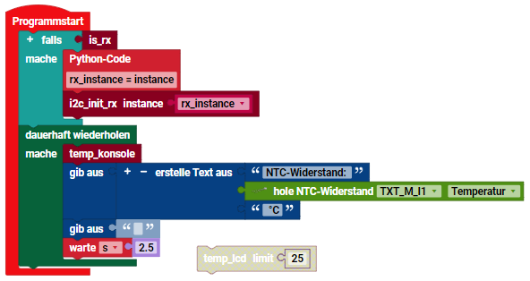
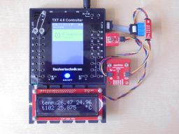
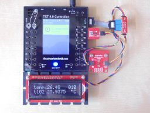
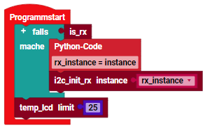

> ROBO Pro Coding I²C Blöcke von fischertechnik GitLab: [ft_Controller_I2C](https://git.fischertechnik-cloud.com/i2c/ft_Controller_I2C)\
> [I²C Module](https://elssner.github.io/ft-Controller-I2C/#tabelle-1) |
[I²C Hardware, Software](https://elssner.github.io/ft-Controller-I2C/#ic) |
[I²C Quellcodedateien, Blöcke](https://elssner.github.io/ft-Controller-I2C/#beschreibung-der-quellcodedateien-alphabetisch-geordnet)\
[I²C Programmierbeispiele im Überblick](../examples)

### s_qwiictemp_lcd (2 Temperatursensoren, Qwiic LCD Display)

* [SparkFun 16x2 SerLCD - RGB Text (Qwiic)](https://www.sparkfun.com/products/16397)
* [SparkFun Micro Temperature Sensor - STTS22H (Qwiic)](https://www.sparkfun.com/products/21273)
* [SparkFun Digital Temperature Sensor - TMP102 (Qwiic)](https://www.sparkfun.com/products/16304)
<!--
Hier sind zwei I²C Temperatur Sensoren angeschlossen: [SparkFun Micro Temperature Sensor - STTS22H (Qwiic)](https://www.sparkfun.com/products/21273) und [SparkFun Digital Temperature Sensor - TMP102 (Qwiic)](https://www.sparkfun.com/products/16304).
Beide Temperaturen werden im LCD Display [SparkFun 16x2 SerLCD - RGB Text (Qwiic)](https://www.sparkfun.com/products/16397) angezeigt.\
Das erste Beispiel zeigt die Temperatur in der Konsole an und braucht kein Display.
-->

Block **temp_konsole**
* Quellcodedateien: **[i2cCode](../#i2ccodepy)**, **[s_qwiictemp](../#s_qwiictemppy)**, **[s_qwiictmp102](../#s_qwiictmp102py)**, **s_qwiictemp_lcd**
* I²C Module: Temperatur Sensoren STTS22H und TMP102
* Laden von fischertechnik GitLab: [I2C_Temperatursensor_LCD](https://git.fischertechnik-cloud.com/i2c/I2C_Temperatursensor_LCD)
* &nbsp;
* Zeigt Name und Temperatur der zwei I²C Sensoren in der Konsole an (2 Zeilen).
* Ohne LCD Display, Anzeige nur bei verbundener App ROBO Pro Coding.
* Einmalige Anzeige, **temp_konsole** muss im Hauptprogramm in Schleife aufgerufen werden.
* Das ermöglicht im Hauptprogramm, auch die Temperatur vom NTC-Widerstand anzuzeigen.
* Folgendes Programm gibt 3 Temperaturen und Leerzeile aus, aller 2,5 Sekunden.

\
Beim RX Controller muss I²C beim Programmstart initialisiert werden.

Ausgabe in Konsole:

> s_qwiictemp (STTS22H): 25.51 °C\
s_qwiictmp102 (TMP102): 25.5625 °C\
NTC-Widerstand: 27.812301793662897 °C\
\
s_qwiictemp (STTS22H): 25.5 °C\
s_qwiictmp102 (TMP102): 25.5 °C\
NTC-Widerstand: 27.72294418150659 °C

Block **temp_lcd** (limit)
* Quellcodedateien: **[i2cCode](../#i2ccodepy)**, **[advanced](../#advancedpy)**, **[qwiiclcd](../#qwiiclcdpy)**, **[s_qwiictemp](../#s_qwiictemppy)**, **[s_qwiictmp102](../#s_qwiictmp102py)**, **s_qwiictemp_lcd**
* I²C Module: LCD Display, Temperatur Sensoren STTS22H und TMP102
* Laden von fischertechnik GitLab: [I2C_Temperatursensor_LCD](https://git.fischertechnik-cloud.com/i2c/I2C_Temperatursensor_LCD)

 \
Zum Vergrößern auf das Bild klicken.

* Parameter *limit* ist eine Höchsttemperatur in °C.
* Zeigt die gemessene Temperatur der zwei I²C Sensoren im LCD Display an.
* Bei Überschreitung der Temperatur *limit* wird /INT ausgelöst (nur am Micro STTS22H Sensor).
* LCD Zeile 1: temp (Micro Sensor), Temperatur, Limit (umgerechnet).
* Bei Überschreitung wird Limit und Status (3 Bit) abwechselnd angezeigt.
* LCD Zeile 2: t102 (großer Sensor), Temperatur °C.
* Wiederholung dauerhaft aller 1 Sekunde.

