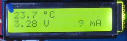
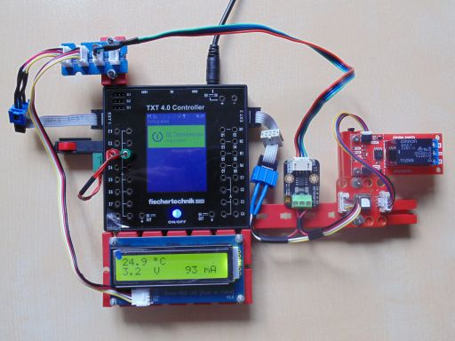
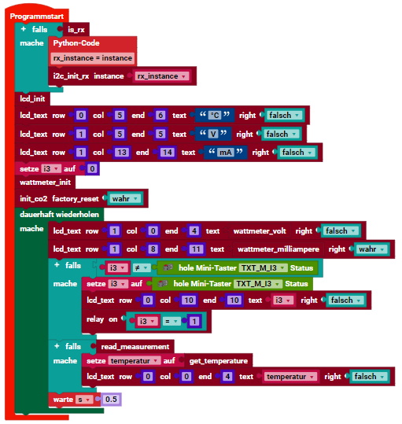

> ROBO Pro Coding I²C Blöcke von fischertechnik GitLab: [ft_Controller_I2C](https://git.fischertechnik-cloud.com/i2c/ft_Controller_I2C)\
> [I²C Module](https://elssner.github.io/ft-Controller-I2C/#tabelle-1) |
[I²C Hardware, Software](https://elssner.github.io/ft-Controller-I2C/#ic) |
[I²C Quellcodedateien, Blöcke](https://elssner.github.io/ft-Controller-I2C/#beschreibung-der-quellcodedateien-alphabetisch-geordnet)\
[I²C Programmierbeispiele im Überblick](../examples)

### wattmeter_co2_relay (Strommessung am I²C-Bus, CO₂ Sensor und Relais)

* [Grove - LCD Display 16x2 Zeichen](https://wiki.seeedstudio.com/Grove-16x2_LCD_Series)
* [SparkFun Qwiic Single Relay](https://www.sparkfun.com/products/15093)
* [Calliope CO2 Sensor - SCD40](https://calliope.cc/calliope-mini/erweiterungen/calliope-co2-sensor)
* [I2C Digital Wattmeter](https://www.dfrobot.com/product-1827.html)

Das 'I2C Digital Wattmeter' genannte Modul misst eigentlich Spannung und Strom am I²C-Bus. Die Spannung sollte 3,3 Volt betragen. Zum Strom messen wurden zwei I²C Module angeschlossen, die einen hohen Stromverbrauch haben.
Der 'CO₂ Sensor' verbraucht nur während der Messungen - ungefähr aller 5 Sekunden - fast 100 mA Strom. 
Das 'Relais' kann im Hauptprogramm an geschaltet werden und verbraucht dann zusätzlich 100 mA. Den gesamten Strom muss der 3,3 Volt I²C-Bus liefern.

Die Anschaltung des Messgerätes am I²C-Kabel ist auf dem Foto zu erkennen. Strom wird nur vom CO₂ Sensor und Relais gemessen.

Bei genauer Beobachtung des Displays wird immer wieder kurzzeitig ein höherer Strom angezeigt, wenn der CO₂ Sensor eine Messung macht. Der Zeitpunkt der Messung kann nicht bestimmt, nur insgesamt an und aus geschaltet werden.

 

> Der CO₂ Sensor funktionierte nur nach dem Einschalten. Wenn ein neues Programm übertragen und gestartet wurde, hat der CO₂ Sensor den I²C-Bus blockiert. Dann muste er immer vom I²C-Kabel getrennt und wieder angesteckt werden.
<!--
* Quellcodedateien: **[i2cCode](../#i2ccodepy)**, **[lcd16x2](../#lcd16x2py)**, **[qwiicrelay](../#qwiicrelaypy)**, **[s_co2](../#s_co2py)**, **[wattmeter](../#wattmeterpy)**
* Laden von fischertechnik GitLab: [I2C_Strommessung_CO2_Relais](https://git.fischertechnik-cloud.com/i2c/I2C_Strommessung_CO2_Relais)

\
Zum Vergrößern auf das Bild klicken.
-->

Block **wattmeter_lcd_co2**
* Quellcodedateien:  **[i2cCode](../#i2ccodepy)**, **[lcd16x2](../#lcd16x2py)**, **[qwiicrelay](../#qwiicrelaypy)**, **[s_co2](../#s_co2py)**, **[wattmeter](../#wattmeterpy)**
* 4 I²C Module: Grove LCD Display, (Qwiic Relay im Hauptprogramm), CO₂ Sensor, Wattmeter
* Laden von fischertechnik GitLab: [I2C_Strommessung_CO2_Relais](https://git.fischertechnik-cloud.com/i2c/I2C_Strommessung_CO2_Relais)

\
Zum Vergrößern auf das Bild klicken.

* Zeigt in Zeile 1 am LCD-Display nur die Temperatur vom CO₂ Sensor an.
* Zeile 2 Spannung (3,3 Volt) und Strom von CO₂ Sensor und Relais am I²C-Bus.
* Wiederholung aller 0,5 Sekunden, um die Strom Änderung vom CO₂ Sensor zu messen.

#### Hauptprogramm

Block **Programmstart**

* Beim RX Controller muss I²C beim Programmstart immer initialisiert werden.

