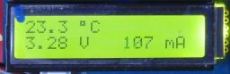

> ROBO Pro Coding I²C Blöcke von fischertechnik GitLab: [ft_Controller_I2C](https://git.fischertechnik-cloud.com/i2c/ft_Controller_I2C)\
> [I²C Module](https://elssner.github.io/ft-Controller-I2C/#tabelle-1) |
[I²C Hardware, Software](https://elssner.github.io/ft-Controller-I2C/#ic) |
[I²C Quellcodedateien, Blöcke](https://elssner.github.io/ft-Controller-I2C/#beschreibung-der-quellcodedateien-alphabetisch-geordnet)\
[I²C Programmierbeispiele im Überblick](../examples)

### wattmeter_co2_relay (Beispiel Strommessung)

Hier sind zwei I²C Temperatur Sensoren angeschlossen: [SparkFun Micro Temperature Sensor - STTS22H (Qwiic)](https://www.sparkfun.com/products/21273) und [SparkFun Digital Temperature Sensor - TMP102 (Qwiic)](https://www.sparkfun.com/products/16304).
Beide Temperaturen werden im LCD Display [SparkFun 16x2 SerLCD - RGB Text (Qwiic)](https://www.sparkfun.com/products/16397) angezeigt.\
Das erste Beispiel zeigt die Temperatur in der Konsole an und braucht kein Display.

* Quellcodedateien: **[i2cCode](../#i2ccodepy)**, **[lcd](../#lcdpy)**, **[qwiicrelay](../#qwiicrelaypy)**, **[s_co2](../#s_co2py)**, **[wattmeter](../#wattmeterpy)**
* Laden von fischertechnik GitLab: [I2C_Strommessung_CO2_Relais](https://git.fischertechnik-cloud.com/i2c/I2C_Strommessung_CO2_Relais)

\
Zum Vergrößern auf das Bild klicken.

 

